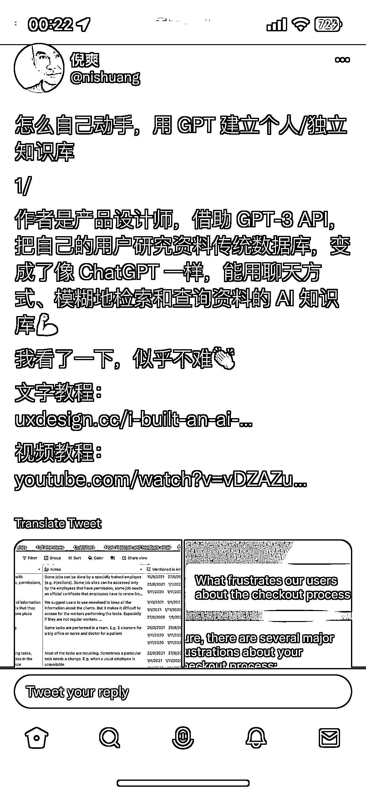

# 自己动手，用 GPT 建立个人-独立知识库的操作方法

> 原文：[`www.yuque.com/for_lazy/xkrm14/wu8h81dxlpw6mzg5`](https://www.yuque.com/for_lazy/xkrm14/wu8h81dxlpw6mzg5)

<ne-p id="u8c478a72" data-lake-id="u8c478a72"><ne-text id="uddea783b">作者： 蛤蟆先生</ne-text></ne-p> <ne-p id="u46bdbc0c" data-lake-id="u46bdbc0c"><ne-text id="u092d9a86">日期：2023-02-23</ne-text></ne-p> <ne-p id="u793e1fb8" data-lake-id="u793e1fb8"><ne-text id="u979c6192">点赞数：</ne-text><ne-text id="uf29ca7d1" ne-bold="true">25</ne-text></ne-p> <ne-hole id="u78776f43" data-lake-id="u78776f43"><ne-card data-card-name="hr" data-card-type="block" id="IQY2p" data-event-boundary="card"><ne-p id="udb502689" data-lake-id="udb502689"><ne-text id="uae21c7b4">正文：</ne-text></ne-p> <ne-p id="u93eb869f" data-lake-id="u93eb869f"><ne-text id="ucfe6ec01">怎么自己动手，用 GPT 建立个人/独立知识库 1/ 作者是产品设计师，借助 GPT-3 API，把自己的用户研究资料传统数据库，变成了像 ChatGPT</ne-text> <ne-text id="uea708c6c">一样，能用聊天方式、模糊地检索和查询资料的 AI 知识库💪 我看了一下，似乎不难👏 文字教程：</ne-text> <ne-text id="u6f00d73c">视频教程：[</ne-text>[<ne-text id="u095f1c9e">https://uxdesign.cc/i-built-an-ai-that-answers-que</ne-text>](https://uxdesign.cc/i-built-an-ai-that-answers-que)<ne-text id="ubbe1aa71">...</ne-text> <ne-text id="u56f9f222">](</ne-text>[<ne-text id="u8daa014f">https://uxdesign.cc/i-built-an-ai-that-answers-questions-based-on-my-user-</ne-text>](https://uxdesign.cc/i-built-an-ai-that-answers-questions-based-on-my-user-)<ne-text id="u148c1818">research-data-7207b052e21c)</ne-text>[<ne-text id="ua7ef9761">https://m.youtube.com/watch?v=vDZAZuaXf48</ne-text>](https://m.youtube.com/watch?v=vDZAZuaXf48)</ne-p> <ne-p id="u534f461a" data-lake-id="u534f461a"><ne-card data-card-name="image" data-card-type="inline" id="MPK4T" data-event-boundary="card">  <ne-hole id="ue7acdd2f" data-lake-id="ue7acdd2f"><ne-card data-card-name="hr" data-card-type="block" id="ywvOW" data-event-boundary="card"><ne-p id="uc3a717ff" data-lake-id="uc3a717ff"><ne-text id="ue2131aa3">评论区：</ne-text></ne-p> <ne-p id="u401490fa" data-lake-id="u401490fa"><ne-text id="uc7841d02">暂无评论</ne-text></ne-p> <ne-hole id="u4ced1c2e" data-lake-id="u4ced1c2e"><ne-card data-card-name="hr" data-card-type="block" id="y6OFF" data-event-boundary="card"><ne-p id="u3384acf3" data-lake-id="u3384acf3"><ne-text id="uace32b57">公众号懒人找资源，懒人专属群分享作者： 财火</ne-text></ne-p> <ne-p id="u4df278ed" data-lake-id="u4df278ed"><ne-text id="u9d19f73c">日期：2023-02-22</ne-text></ne-p> <ne-p id="u69f1e311" data-lake-id="u69f1e311"><ne-text id="ubf942734">点赞数：</ne-text><ne-text id="u8a8285f2" ne-bold="true">28</ne-text></ne-p> <ne-hole id="u4bc7de6a" data-lake-id="u4bc7de6a"><ne-card data-card-name="hr" data-card-type="block" id="ofOyd" data-event-boundary="card"><ne-p id="u0b73547f" data-lake-id="u0b73547f"><ne-text id="ua047d429">正文：</ne-text></ne-p> <ne-p id="u87c11e07" data-lake-id="u87c11e07"><ne-text id="u9169b9c0">怎么自己动手，用 GPT 建立个人/独立知识库？ 借助 GPT-3 API，把自己的用户研究资料传统数据库，变成了像 ChatGPT</ne-text> <ne-text id="u9d187ab3">一样，能用聊天方式、模糊地检索和查询资料的 AI 知识库。 文字教程： 视频教程： [</ne-text>[<ne-text id="u7a934e59">https://uxdesign.cc/i-built-an-ai-</ne-text>](https://uxdesign.cc/i-built-an-ai-)<ne-text id="ub5878b45">that-answers-que... ](</ne-text>[<ne-text id="uad26626d">https://uxdesign.cc/i-built-an-ai-that-answers-</ne-text>](https://uxdesign.cc/i-built-an-ai-that-answers-)<ne-text id="u2e6f269c">questions-based-on-my-user-research-</ne-text> <ne-text id="uf88ec275">data-7207b052e21c)</ne-text>[<ne-text id="u4b08d963">https://www.youtube.com/watch?v=vDZAZuaXf48</ne-text>](https://www.youtube.com/watch?v=vDZAZuaXf48)</ne-p> <ne-hole id="ubbe1b7f7" data-lake-id="ubbe1b7f7"><ne-card data-card-name="hr" data-card-type="block" id="EHBU7" data-event-boundary="card"><ne-p id="ud93a18d5" data-lake-id="ud93a18d5"><ne-text id="uff11ebcb">评论区：</ne-text></ne-p> <ne-p id="u748c4616" data-lake-id="u748c4616"><ne-text id="u6ff83b11">奶爸超人 : 风向标现在好卷，不断看到重复的，需要加入去重功能了[偷笑]</ne-text></ne-p> <ne-p id="ue0866535" data-lake-id="ue0866535"><ne-text id="ua979ed33">财火 : 啊？在哪里</ne-text></ne-p> <ne-p id="u3082c0d6" data-lake-id="u3082c0d6"><ne-text id="u6583a6dd">奶爸超人 : 发的比你晚一点[呲牙]</ne-text></ne-p> <ne-p id="u6cda32ea" data-lake-id="u6cda32ea"><ne-text id="u5a7c8670">财火 : 哦哦</ne-text></ne-p> <ne-hole id="uc74b3563" data-lake-id="uc74b3563"><ne-card data-card-name="hr" data-card-type="block" id="ekEfq" data-event-boundary="card"><ne-p id="u4a19dd51" data-lake-id="u4a19dd51"><ne-text id="u214ed9d4">公众号懒人找资源，懒人专属群分享</ne-text></ne-p></ne-card></ne-hole></ne-card></ne-hole></ne-card></ne-hole></ne-card></ne-hole></ne-card></ne-hole></ne-card></ne-p></ne-card></ne-hole>