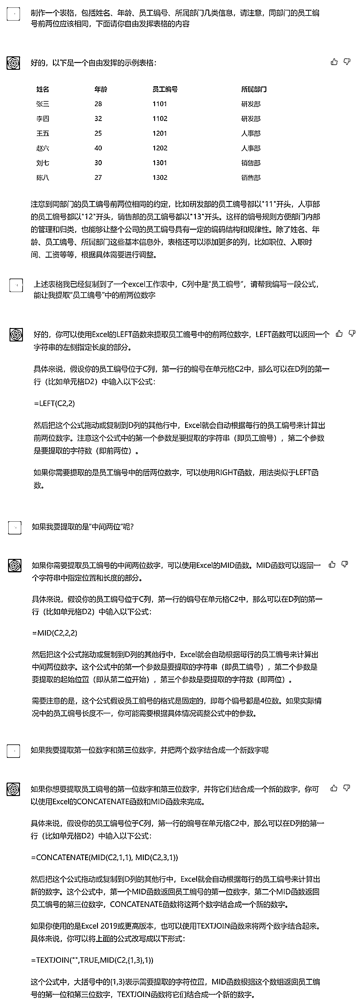
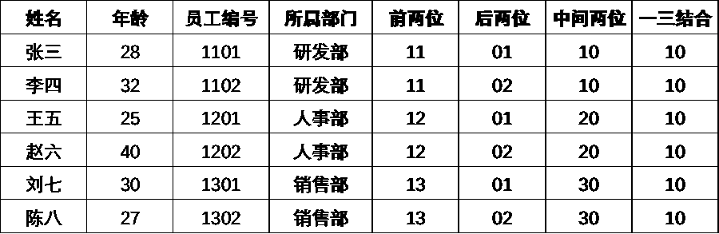
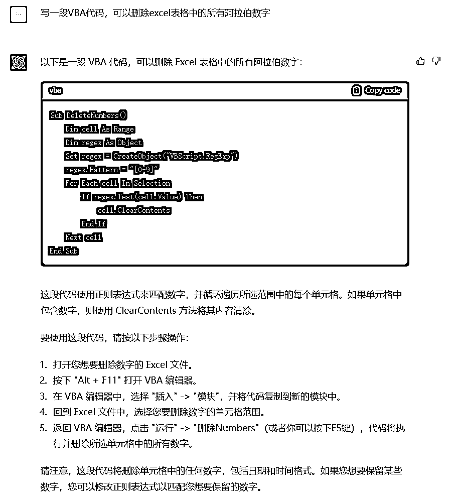

# 使用 ChatGPT 来操作 excel 表格，提升工作效率

> 原文：[`www.yuque.com/for_lazy/xkrm14/hmzie0m0tle5pm27`](https://www.yuque.com/for_lazy/xkrm14/hmzie0m0tle5pm27)

<ne-p id="u226c54fa" data-lake-id="u226c54fa"><ne-text id="u89a5361d">作者： 麻木尔杜斯戈里亚</ne-text></ne-p> <ne-p id="udcd96abc" data-lake-id="udcd96abc"><ne-text id="ubba07157">日期：2023-02-22</ne-text></ne-p> <ne-p id="udf665167" data-lake-id="udf665167"><ne-text id="ua0a7a78b">点赞数：</ne-text><ne-text id="u0e2b42db" ne-bold="true">28</ne-text></ne-p> <ne-hole id="ub5fdf78c" data-lake-id="ub5fdf78c"><ne-card data-card-name="hr" data-card-type="block" id="lD0qz" data-event-boundary="card"><ne-p id="u7f4efd0d" data-lake-id="u7f4efd0d"><ne-text id="u3be2ae6a">正文：</ne-text></ne-p> <ne-p id="u00deeb78" data-lake-id="u00deeb78"><ne-text id="u3da5555b">使用 ChatGPT 来操作 excel 表格，工作效率+1</ne-text> <ne-text id="u279ba398">用 excel 来做些数据统计/分析的时候，有时候会遇到用自然语言说起来挺简单，但公式写起来巨恶心的任务。现在有了 ChatGPT，就不需要你花脑细胞记公式，理书写逻辑了（还容易笔误），直接用自然语言告诉它你想干什么就行了。</ne-text> <ne-text id="uc19adc01">比如提取“某列数字（电话号码/员工编号）”中的某几位（如图 1、图 2）。</ne-text> <ne-text id="u82244ab2">除了公式之外，VBA 代码当然也可以（如图 3、图 4），它会给出代码和详细的操作步骤，并贴心地提示你一些需要注意的细节。</ne-text></ne-p> <ne-p id="udd5c73cb" data-lake-id="udd5c73cb"><ne-card data-card-name="image" data-card-type="inline" id="Vgoc7" data-event-boundary="card"></ne-card></ne-p> <ne-p id="u4cd35974" data-lake-id="u4cd35974"><ne-card data-card-name="image" data-card-type="inline" id="gZfD5" data-event-boundary="card"></ne-card></ne-p> <ne-p id="u7e3520e2" data-lake-id="u7e3520e2"><ne-card data-card-name="image" data-card-type="inline" id="F8flD" data-event-boundary="card"></ne-card></ne-p> <ne-p id="ua0abcb95" data-lake-id="ua0abcb95"><ne-card data-card-name="image" data-card-type="inline" id="kn2oI" data-event-boundary="card"></ne-card></ne-p> <ne-hole id="uecfe791b" data-lake-id="uecfe791b"><ne-card data-card-name="hr" data-card-type="block" id="Eg97E" data-event-boundary="card"><ne-p id="uce485ef4" data-lake-id="uce485ef4"><ne-text id="ufae60daf">评论区：</ne-text></ne-p> <ne-hole id="u97473f8b" data-lake-id="u97473f8b"><ne-card data-card-name="hr" data-card-type="block" id="qtGVp" data-event-boundary="card"><ne-p id="u9be1718e" data-lake-id="u9be1718e"><ne-text id="ub5b3aba7">公众号懒人找资源，懒人专属群分享</ne-text></ne-p></ne-card></ne-hole></ne-card></ne-hole></ne-card></ne-hole>