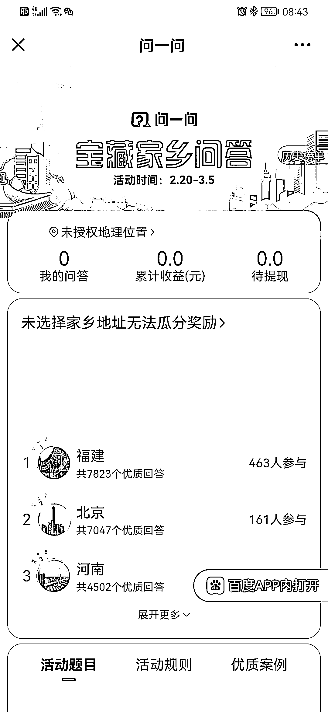
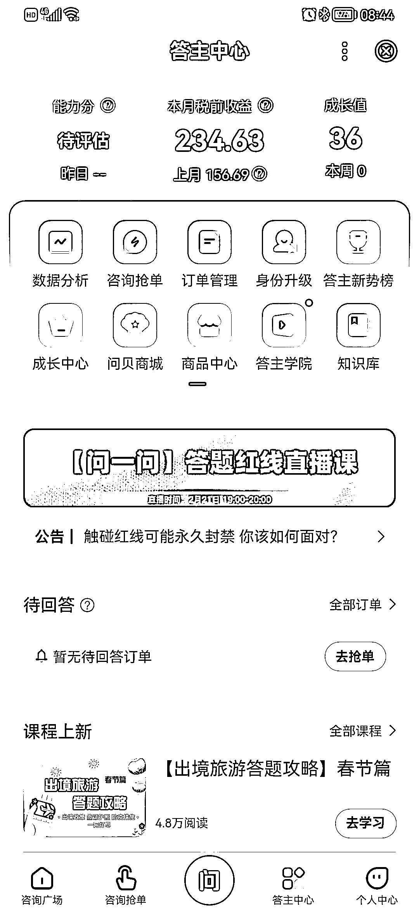

# chatGPT＋百度问答赚钱小攻略

> 原文：[`www.yuque.com/for_lazy/xkrm14/ch3mll6y15d01g7d`](https://www.yuque.com/for_lazy/xkrm14/ch3mll6y15d01g7d)

作者： 陈龙

日期：2023-02-21

点赞数：71

正文：

chatGPT＋百度问答赚钱小攻略 1.自己答题，一道题几毛到几块，不同领域价格不同，生活领域 0.8-1.2 左右，一小时 40-50 题左右，时间不值钱的可以去做 2.做教程，陪伴群，市场价 299-499，还可以做分销，找靠谱团队去承接流量 备注，起号阶段没有啥题目可以做，可以去刷宝藏家乡，问呗也是可以换成钱的

评论区：

a 飛 : 我们也在做，有机会一起交流交流

陈龙 : 欢迎[呲牙]

逻各斯马 : 1，如果能批量化，自动化就厉害了

太波 : 结合 rpa 就自动玩了，好像已经有圈友这么做了

陈龙 : 是啊，那就是全自动赚钱了

陈龙 : 哇，这么厉害

公众号懒人找资源，懒人专属群分享

