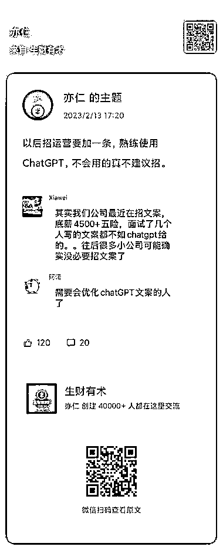
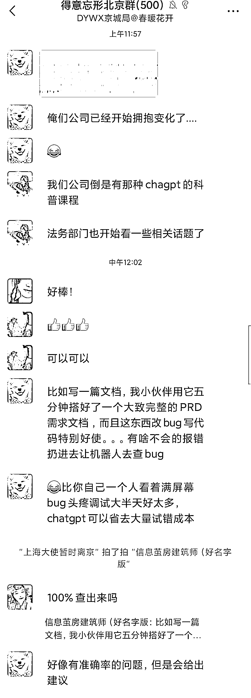

# ChatGPT 航海，总结使用方法和技巧，可以为工作提效

> 原文：[`www.yuque.com/for_lazy/xkrm14/xnc1uisq0yf0ohx0`](https://www.yuque.com/for_lazy/xkrm14/xnc1uisq0yf0ohx0)

<ne-p id="u2423fe01" data-lake-id="u2423fe01"><ne-text id="ua8e8fd6e">作者： 常常</ne-text></ne-p> <ne-p id="uc315a681" data-lake-id="uc315a681"><ne-text id="u734a8003">日期：2023-02-20</ne-text></ne-p> <ne-p id="u9facfd4b" data-lake-id="u9facfd4b"><ne-text id="u4839f679">点赞数：</ne-text><ne-text id="u9f0c78a5" ne-bold="true">29</ne-text></ne-p> <ne-hole id="u95f9785b" data-lake-id="u95f9785b"><ne-card data-card-name="hr" data-card-type="block" id="Sl1Cm" data-event-boundary="card"><ne-p id="u199e5ff7" data-lake-id="u199e5ff7"><ne-text id="u8ca15cb1">正文：</ne-text></ne-p> <ne-p id="u2baee44f" data-lake-id="u2baee44f"><ne-text id="u005f68ed">北京已经有公司开始培训员工使用 ChatGPT 进行工作提效了，</ne-text> <ne-text id="u455cbcfc">目前市场上，对于 ChatGPT 的使用方法和技巧，还有很多可以去填补的空白，如果对 ChatGPT 感兴趣，一定要努力输出。</ne-text> <ne-text id="uf710d41b">报名了 ChatGPT 航海实战的朋友们，可以把航海实战中学到的直接去自己的行业提效应用，只要你先总结出方法，你就是行业内使用 ChatGPT 的高手。</ne-text> <ne-text id="udb85132b">话说，在生财中，亦仁的判断才是最明显的风向标吧😂</ne-text></ne-p> <ne-p id="uaf4a2d67" data-lake-id="uaf4a2d67"><ne-card data-card-name="image" data-card-type="inline" id="G2DjX" data-event-boundary="card">  <ne-p id="ucc61fe9f" data-lake-id="ucc61fe9f"><ne-card data-card-name="image" data-card-type="inline" id="DeNPO" data-event-boundary="card">  <ne-p id="ud4df1cf8" data-lake-id="ud4df1cf8"><ne-card data-card-name="image" data-card-type="inline" id="mLfHz" data-event-boundary="card">  <ne-hole id="ueded3c06" data-lake-id="ueded3c06"><ne-card data-card-name="hr" data-card-type="block" id="zDEmv" data-event-boundary="card"><ne-p id="u8dcb35c3" data-lake-id="u8dcb35c3"><ne-text id="ub2287c76">评论区：</ne-text></ne-p> <ne-p id="u0d858182" data-lake-id="u0d858182"><ne-text id="u451cc153">常常 : 谢谢老大[玫瑰]</ne-text></ne-p> <ne-hole id="u665865d2" data-lake-id="u665865d2"><ne-card data-card-name="hr" data-card-type="block" id="VokZc" data-event-boundary="card"><ne-p id="u617548eb" data-lake-id="u617548eb"><ne-text id="ubb4e820f">公众号懒人找资源，懒人专属群分享</ne-text></ne-p></ne-card></ne-hole></ne-card></ne-hole></ne-card></ne-p></ne-card></ne-p></ne-card></ne-p></ne-card></ne-hole>