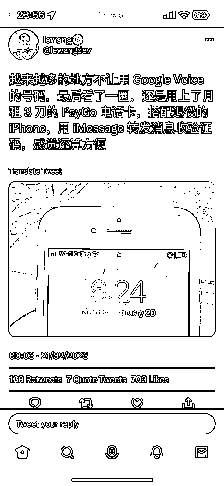

# 月租 3 刀的 PayGo 电话卡，搭配 iPhone，可用 iMessage 收验证码

> 原文：[`www.yuque.com/for_lazy/xkrm14/ruy8ckuencysdgpv`](https://www.yuque.com/for_lazy/xkrm14/ruy8ckuencysdgpv)

作者： 蛤蟆先生

日期：2023-02-23

点赞数：25

<ne-hole id="u7cb4e24b" data-lake-id="u7cb4e24b"><ne-card data-card-name="hr" data-card-type="block" id="DdM6z" data-event-boundary="card">

正文：

越来越多的地方不让用 Google Voice 的号码，可以试下月租 3 刀的 PayGo 电话卡（也有英国的 giff 卡，0 月租，具体可以去 tb 搜索看看），搭配 iPhone，可以用 iMessage 转发消息收验证码。 支持双卡 iPhone，支持多个苹果设备之间转发消息。

<ne-card data-card-name="image" data-card-type="inline" id="BfVGP" data-event-boundary="card"></ne-card>

<ne-hole id="ub889d2e0" data-lake-id="ub889d2e0"><ne-card data-card-name="hr" data-card-type="block" id="rklAy" data-event-boundary="card">

评论区：

外夏 : 配合美版 iphone 可以直接使用 esim 无需购买实体卡

<ne-hole id="u63dd69e4" data-lake-id="u63dd69e4"><ne-card data-card-name="hr" data-card-type="block" id="x2S6u" data-event-boundary="card">

公众号懒人找资源，懒人专属群分享

</ne-card></ne-hole></ne-card></ne-hole></ne-card></ne-hole>