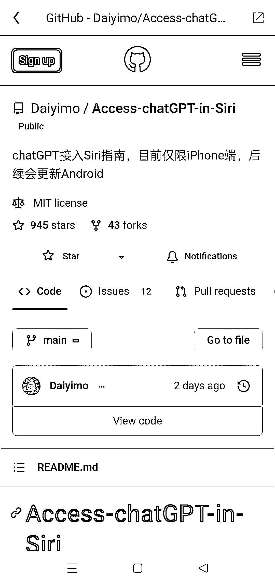
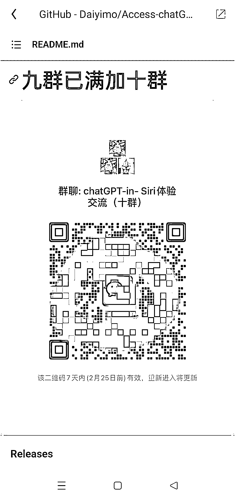

# 《ChatGPT 接入 Siri 指南》，可用来引流

> 原文：[`www.yuque.com/for_lazy/xkrm14/txqemi8g0w4zac3s`](https://www.yuque.com/for_lazy/xkrm14/txqemi8g0w4zac3s)

作者： 奇点

日期：2023-02-21

点赞数：18

<ne-card data-card-name="hr" data-card-type="block" id="Erozb" data-event-boundary="card">

正文：

《ChatGPT 接入 Siri 指南》 不管是自用来提高效率，还是做教程引流，都可以的。 异常值：教程底部附有微信群二维码，已经开到第 10 个群了，算下来差不多引流了接近 2000 人。[GitHub+-+Daiyimo/Access-chatGPT- in-Siri:+chatGPT 接入...](https://github.com/Daiyimo/Access-chatGPT-in-Siri)

<ne-card data-card-name="image" data-card-type="inline" id="UMwfn" data-event-boundary="card">  <ne-p id="u1838586d" data-lake-id="u1838586d"><ne-card data-card-name="image" data-card-type="inline" id="vd9by" data-event-boundary="card">  <ne-p id="u5dab0512" data-lake-id="u5dab0512"><ne-card data-card-name="image" data-card-type="inline" id="Utx5T" data-event-boundary="card">  <ne-card data-card-name="hr" data-card-type="block" id="DUpdG" data-event-boundary="card"><ne-p id="u029a0cc0" data-lake-id="u029a0cc0">评论区：

如也 : 被投诉掉了好像，打不开了

奇点 : 可以访问

<ne-card data-card-name="hr" data-card-type="block" id="ZFbZo" data-event-boundary="card">

公众号懒人找资源，懒人专属群分享

</ne-card></ne-card></ne-card></ne-p></ne-card></ne-p></ne-card></ne-p></ne-card>