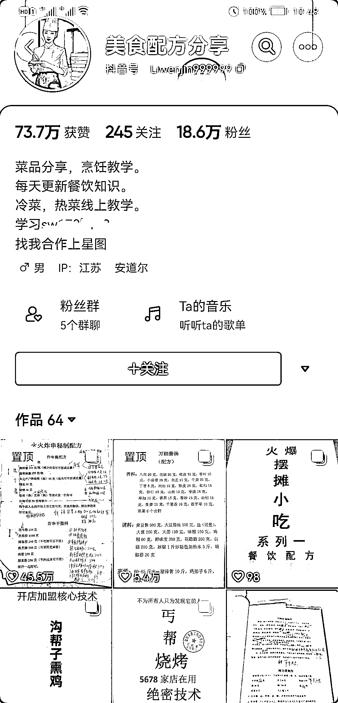
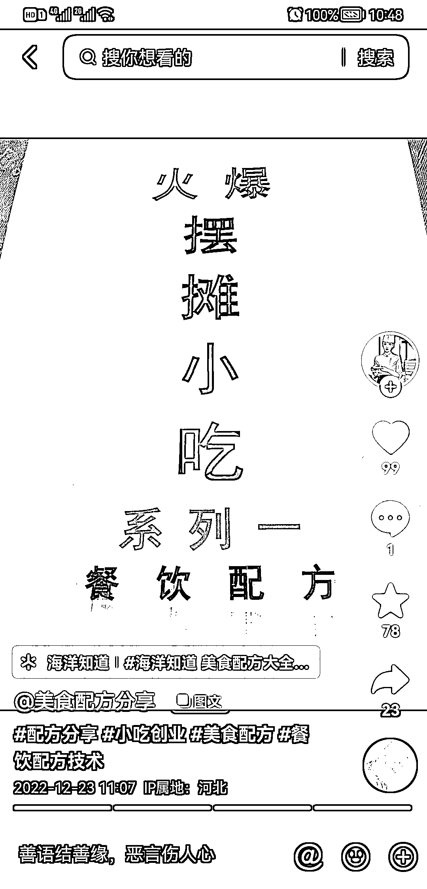
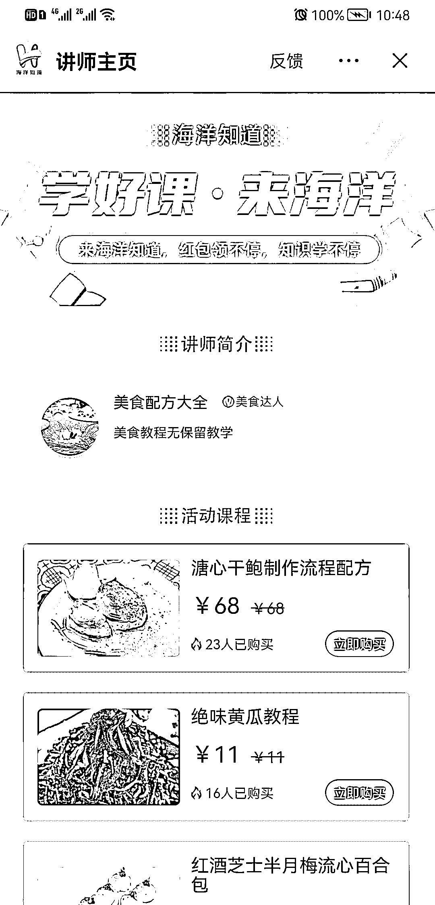

# 抖音美食配方图文号，引流卖美食配方资料或者课程

> 原文：[`www.yuque.com/for_lazy/xkrm14/ck81d7nksiyllvst`](https://www.yuque.com/for_lazy/xkrm14/ck81d7nksiyllvst)

<ne-p id="u24bad0e1" data-lake-id="u24bad0e1"><ne-text id="u829e10c1">作者： will</ne-text></ne-p> <ne-p id="u415650cd" data-lake-id="u415650cd"><ne-text id="ufb7423f2">日期：2023-02-23</ne-text></ne-p> <ne-p id="u00545e51" data-lake-id="u00545e51"><ne-text id="u6a802212">点赞数：</ne-text><ne-text id="uc16f9535" ne-bold="true">25</ne-text></ne-p> <ne-hole id="uf6d4a1a7" data-lake-id="uf6d4a1a7"><ne-card data-card-name="hr" data-card-type="block" id="PJrYM" data-event-boundary="card"><ne-p id="u3008aaf6" data-lake-id="u3008aaf6"><ne-text id="u7203d891">正文：</ne-text></ne-p> <ne-p id="u63a44943" data-lake-id="u63a44943"><ne-text id="ubeab8260">蹭抖音图文流量，做美食配方图文号，卖美食配方资料或者课程，还可引流加微信私域等变现</ne-text></ne-p> <ne-p id="ufe25da5d" data-lake-id="ufe25da5d"><ne-card data-card-name="image" data-card-type="inline" id="mVIlD" data-event-boundary="card">  <ne-p id="u4afd2778" data-lake-id="u4afd2778"><ne-card data-card-name="image" data-card-type="inline" id="tgQkE" data-event-boundary="card">  <ne-p id="u0ccdd5c3" data-lake-id="u0ccdd5c3"><ne-card data-card-name="image" data-card-type="inline" id="glsh8" data-event-boundary="card">  <ne-hole id="uaae08946" data-lake-id="uaae08946"><ne-card data-card-name="hr" data-card-type="block" id="tFlud" data-event-boundary="card"><ne-p id="u15c2124d" data-lake-id="u15c2124d"><ne-text id="u03922601">评论区：</ne-text></ne-p> <ne-hole id="uf74c71b8" data-lake-id="uf74c71b8"><ne-card data-card-name="hr" data-card-type="block" id="LwQMz" data-event-boundary="card"><ne-p id="u691d9e3f" data-lake-id="u691d9e3f"><ne-text id="u7180d6d9">公众号懒人找资源，懒人专属群分享</ne-text></ne-p></ne-card></ne-hole></ne-card></ne-hole></ne-card></ne-p></ne-card></ne-p></ne-card></ne-p></ne-card></ne-hole>