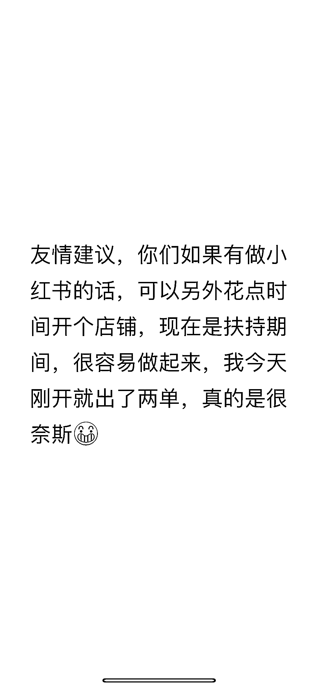

# 小红书店铺有红利，容易开单

> 原文：[`www.yuque.com/for_lazy/xkrm14/eus6cmniakgcoa8f`](https://www.yuque.com/for_lazy/xkrm14/eus6cmniakgcoa8f)

作者： 萤火虫

日期：2023-02-24

点赞数：37

<ne-card data-card-name="hr" data-card-type="block" id="SGeYh" data-event-boundary="card">

正文：

如图，在公众号的圈子都出现这种信息了，是不是真的说明小红书店铺好做

<ne-card data-card-name="image" data-card-type="inline" id="oUhSk" data-event-boundary="card">  <ne-card data-card-name="hr" data-card-type="block" id="W08MB" data-event-boundary="card"><ne-p id="u1ec3aa6d" data-lake-id="u1ec3aa6d">评论区：

喇叭声 : 女装么

竹隐 : 笔记挂商品出单的？

萤火虫 : 不太清楚，我只是在群里看到了这条信息

老彭 : 如果开店铺的话，谁有资源对接呀[囧]

萤火虫 : 星球栏目：资源对接

<ne-card data-card-name="hr" data-card-type="block" id="Qejqt" data-event-boundary="card">

公众号懒人找资源，懒人专属群分享

</ne-card></ne-card></ne-card></ne-p></ne-card>