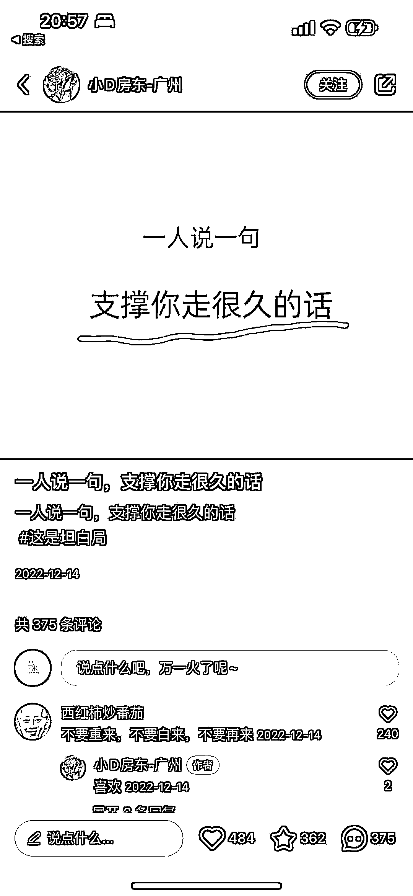
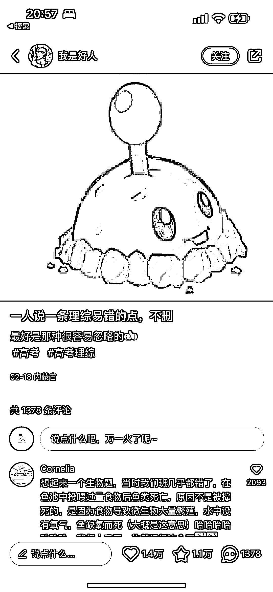
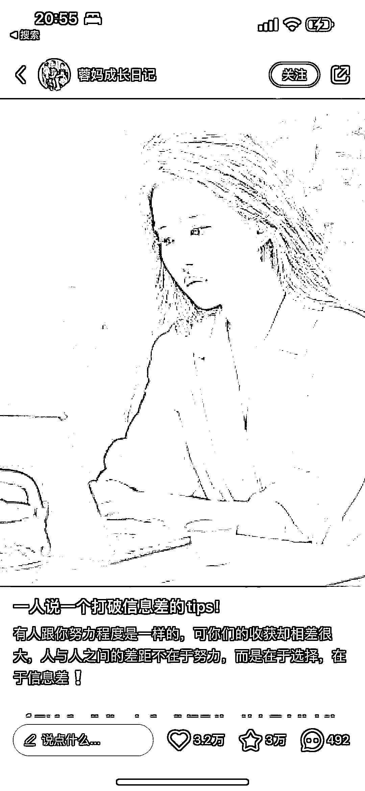

# 小红书一人说一个系列文案，互动数据好

> 原文：[`www.yuque.com/for_lazy/xkrm14/xagpbysk7yc0wy1a`](https://www.yuque.com/for_lazy/xkrm14/xagpbysk7yc0wy1a)

<ne-p id="u0bf13cf0" data-lake-id="u0bf13cf0"><ne-text id="u09f5ba13">作者： 三米</ne-text></ne-p> <ne-p id="u3262d438" data-lake-id="u3262d438"><ne-text id="ub0c75d92">日期：2023-02-23</ne-text></ne-p> <ne-p id="u7e406c75" data-lake-id="u7e406c75"><ne-text id="uef46266f">点赞数：</ne-text><ne-text id="u1a023206" ne-bold="true">42</ne-text></ne-p> <ne-hole id="u93070806" data-lake-id="u93070806"><ne-card data-card-name="hr" data-card-type="block" id="ohV9b" data-event-boundary="card"><ne-p id="u2182d674" data-lake-id="u2182d674"><ne-text id="u4d5f3895">正文：</ne-text></ne-p> <ne-p id="u63d85538" data-lake-id="u63d85538"><ne-text id="u364b20fc">小红书主题：一人说一个系列 一人说一个行业内幕 一人说一个 30 岁建议 一人说一个 这类不一定会爆。但是模仿得对，大概率能爆。</ne-text> <ne-text id="u79d60f02">因为“好为人师”和人类的表达欲望。 促使看到这样的标题就会不由自主的互动。 一互动，这数据就推起来了……</ne-text></ne-p> <ne-p id="u0b4b17c9" data-lake-id="u0b4b17c9"><ne-card data-card-name="image" data-card-type="inline" id="MZokY" data-event-boundary="card"></ne-card></ne-p> <ne-p id="u99a74d26" data-lake-id="u99a74d26"><ne-card data-card-name="image" data-card-type="inline" id="dlIfC" data-event-boundary="card"></ne-card></ne-p> <ne-p id="udcc8a8b1" data-lake-id="udcc8a8b1"><ne-card data-card-name="image" data-card-type="inline" id="zFpfr" data-event-boundary="card"></ne-card></ne-p> <ne-p id="ubda0d26f" data-lake-id="ubda0d26f"><ne-card data-card-name="image" data-card-type="inline" id="gBJNP" data-event-boundary="card"></ne-card></ne-p> <ne-p id="ud1f20a21" data-lake-id="ud1f20a21"><ne-card data-card-name="image" data-card-type="inline" id="zimNR" data-event-boundary="card"></ne-card></ne-p> <ne-p id="uda303220" data-lake-id="uda303220"><ne-card data-card-name="image" data-card-type="inline" id="yvfHJ" data-event-boundary="card"></ne-card></ne-p> <ne-p id="u61e3a49c" data-lake-id="u61e3a49c"><ne-card data-card-name="image" data-card-type="inline" id="dOjag" data-event-boundary="card"></ne-card></ne-p> <ne-p id="u4d671f66" data-lake-id="u4d671f66"><ne-card data-card-name="image" data-card-type="inline" id="HUtM2" data-event-boundary="card"></ne-card></ne-p> <ne-p id="u365d8c47" data-lake-id="u365d8c47"><ne-card data-card-name="image" data-card-type="inline" id="b3RqM" data-event-boundary="card"></ne-card></ne-p> <ne-hole id="ua086af69" data-lake-id="ua086af69"><ne-card data-card-name="hr" data-card-type="block" id="H2y9K" data-event-boundary="card"><ne-p id="u0e68d81c" data-lake-id="u0e68d81c"><ne-text id="u26192ae6">评论区：</ne-text></ne-p> <ne-hole id="ua48d9a5c" data-lake-id="ua48d9a5c"><ne-card data-card-name="hr" data-card-type="block" id="WZE9Q" data-event-boundary="card"><ne-p id="u9dfef526" data-lake-id="u9dfef526"><ne-text id="ua1bcd9d1">公众号懒人找资源，懒人专属群分享</ne-text></ne-p></ne-card></ne-hole></ne-card></ne-hole></ne-card></ne-hole>