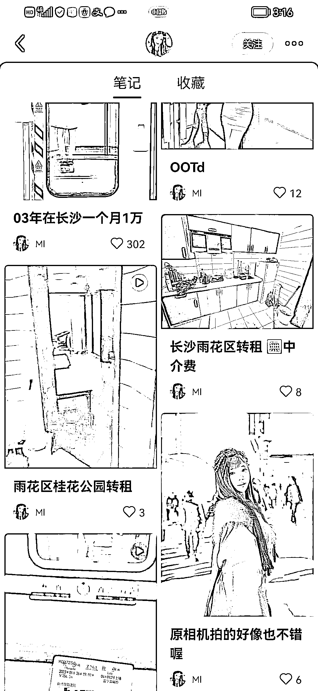

# 利用小红书在线上引流案例

> 原文：[`www.yuque.com/for_lazy/xkrm14/agakdwb7irlqi23d`](https://www.yuque.com/for_lazy/xkrm14/agakdwb7irlqi23d)

作者： 剽悍的大春

日期：2023-02-23

点赞数：27

<ne-hole id="u61e1c92e" data-lake-id="u61e1c92e"><ne-card data-card-name="hr" data-card-type="block" id="IjFoS" data-event-boundary="card">

正文：

房东如何利用小红书在线上引流找租客？ 1⃣️发布一个求合租的小红书，(具体租的位置，可以到哪一块地区)最好是配一个美女！下面评论区一片都是求合租的！ 然后私信引流到私域成交

<ne-card data-card-name="image" data-card-type="inline" id="lxIVQ" data-event-boundary="card"></ne-card>

<ne-card data-card-name="image" data-card-type="inline" id="NV8aI" data-event-boundary="card"></ne-card>

<ne-hole id="u835bdb69" data-lake-id="u835bdb69"><ne-card data-card-name="hr" data-card-type="block" id="gqW96" data-event-boundary="card">

评论区：

剽悍的大春 : 第一次中标，开心[呲牙]

<ne-hole id="uce012cc4" data-lake-id="uce012cc4"><ne-card data-card-name="hr" data-card-type="block" id="hILBo" data-event-boundary="card">

公众号懒人找资源，懒人专属群分享

</ne-card></ne-hole></ne-card></ne-hole></ne-card></ne-hole>