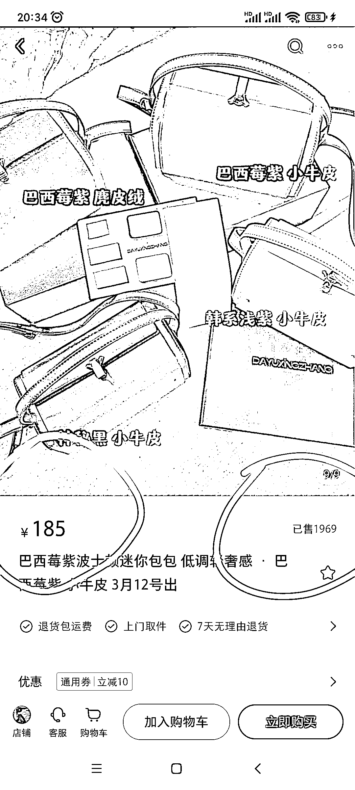
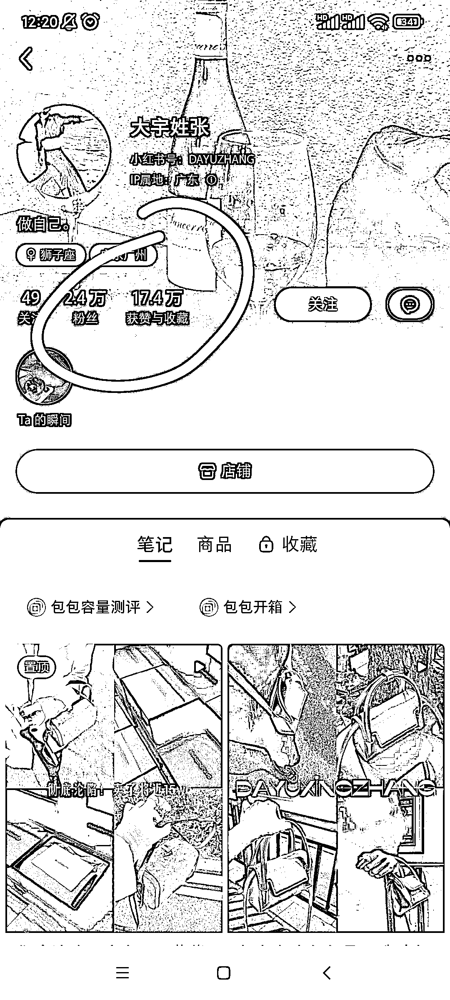
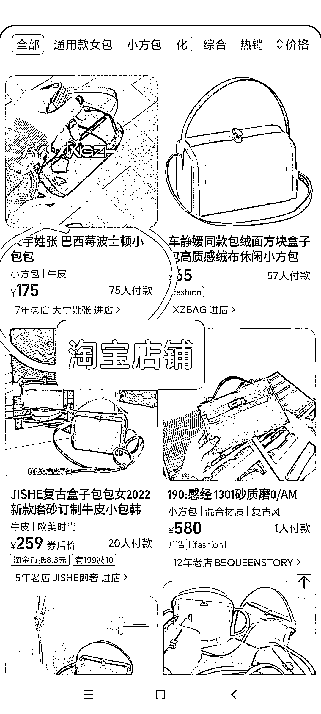

# 小红书店铺，3 种玩法拆解

> 原文：[`www.yuque.com/for_lazy/xkrm14/dydg3hr9m3s9k0sg`](https://www.yuque.com/for_lazy/xkrm14/dydg3hr9m3s9k0sg)

<ne-p id="udc2b6639" data-lake-id="udc2b6639"><ne-text id="ube6d024c">作者： 阿黎</ne-text></ne-p> <ne-p id="u60100ac7" data-lake-id="u60100ac7"><ne-text id="u88effc02">日期：2023-02-23</ne-text></ne-p> <ne-p id="u05fec7fa" data-lake-id="u05fec7fa"><ne-text id="u53f145e9">点赞数：</ne-text><ne-text id="ub1c79e44" ne-bold="true">38</ne-text></ne-p> <ne-hole id="uaaa59ff4" data-lake-id="uaaa59ff4"><ne-card data-card-name="hr" data-card-type="block" id="pYNDT" data-event-boundary="card"><ne-p id="uc3dbdf16" data-lake-id="uc3dbdf16"><ne-text id="ud46ff5ea">正文：</ne-text></ne-p> <ne-p id="u05343471" data-lake-id="u05343471"><ne-text id="uad12cf97">小红书店铺，3 种玩法，适合 2 种人(自有货源的商家，无货源代发的朋友)，大家大航海冲! 玩法</ne-text> <ne-text id="u0dfc937a">1.无货源，选品后，小红书矩阵铺货，每个号基本靠怼量，翻来覆去就拍几个品，，有条件配合淘宝或微信，也能引来流量! 见图 1-5 2.笔记分销，图 6(来自</ne-text> <ne-text id="ud70530ba">嘻嘻|溪溪的风向标分享)</ne-text> <ne-text id="uca9346d0">3.自有货源，或者能找到厂家的商家，可以在爆款的基础上，做改款，图 1-5 里面的紫色包包，前段时间貌似还蛮少的，感觉是从黑色的包包改款而来。</ne-text></ne-p> <ne-p id="uc7946620" data-lake-id="uc7946620"><ne-card data-card-name="image" data-card-type="inline" id="hEikX" data-event-boundary="card">  <ne-p id="u7c14f4db" data-lake-id="u7c14f4db"><ne-card data-card-name="image" data-card-type="inline" id="jioF2" data-event-boundary="card">  <ne-p id="ud6110322" data-lake-id="ud6110322"><ne-card data-card-name="image" data-card-type="inline" id="hzd4W" data-event-boundary="card">  <ne-p id="uf7a88848" data-lake-id="uf7a88848"><ne-card data-card-name="image" data-card-type="inline" id="BwE5b" data-event-boundary="card">  <ne-p id="u520d24f0" data-lake-id="u520d24f0"><ne-card data-card-name="image" data-card-type="inline" id="FXKrQ" data-event-boundary="card">  <ne-p id="ue909d00a" data-lake-id="ue909d00a"><ne-card data-card-name="image" data-card-type="inline" id="phUTc" data-event-boundary="card">  <ne-hole id="u04d4a7c6" data-lake-id="u04d4a7c6"><ne-card data-card-name="hr" data-card-type="block" id="NMowQ" data-event-boundary="card"><ne-p id="u1808b88d" data-lake-id="u1808b88d"><ne-text id="u4f9f8b64">评论区：</ne-text></ne-p> <ne-hole id="ue3ac1dfa" data-lake-id="ue3ac1dfa"><ne-card data-card-name="hr" data-card-type="block" id="YOdBJ" data-event-boundary="card"><ne-p id="u2f952589" data-lake-id="u2f952589"><ne-text id="u78d67dd1">公众号懒人找资源，懒人专属群分享</ne-text></ne-p></ne-card></ne-hole></ne-card></ne-hole></ne-card></ne-p></ne-card></ne-p></ne-card></ne-p></ne-card></ne-p></ne-card></ne-p></ne-card></ne-p></ne-card></ne-hole>