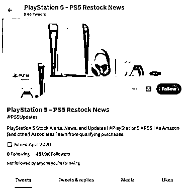

# 海外自媒体之自动化案例

> 原文：[`www.yuque.com/for_lazy/xkrm14/xx65owlnm3xvf7hp`](https://www.yuque.com/for_lazy/xkrm14/xx65owlnm3xvf7hp)

作者： 米笠

日期：2023-02-23

点赞数：25

正文：

海外自媒体之自动化案例 这个推上的自媒体专门发送的是 PS5 的抢购链接 美国的 ps5 发售是通过 Amazon、Bestbuy、Walmart 等几个电商网站不定时上架 这个博主就通过代码，秒级监控这几个电商平台的发售链接 只要有库存上架，就马上自动发推 通过自动化发推，积累了 45 万粉丝 现在主要通过推荐游戏、接广告等方式变现。

  

  

评论区：

陈真 : 国内都是自己抢购，然后加价卖掉。 这种是前期没有利润，粉丝数起来了才有利润。 国内可以做一个提醒抢购茅台的软件，每个平台都是固定时间，可以提前 5 分钟提醒。不知道效果怎么样。

繁星 : 茅台自己做了 app

安能一笑抿红尘 : 你说的这种 app 太多了，我有好几个！从球鞋上架提醒转过来的

公众号懒人找资源，懒人专属群分享

