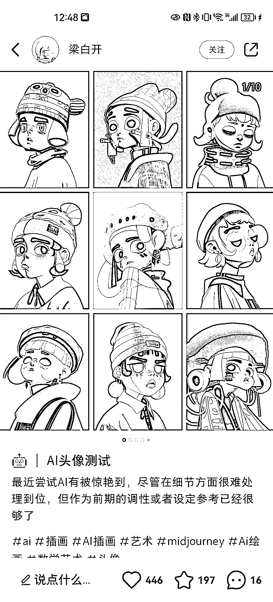

# 小红书 AI 绘画，写实风格真人数据很好

> 原文：[`www.yuque.com/for_lazy/xkrm14/ivf4lx9mgk0x4ent`](https://www.yuque.com/for_lazy/xkrm14/ivf4lx9mgk0x4ent)

作者： 王大诗

日期：2023-02-22

点赞数：37

正文：

已报名本期的 AI 绘画和 chatgpt，航海开始前提前关注了一下市场同类账号，最近写实风格，AI 真人数据很好，已经等不急航海了，我已经开始发第一篇小红书了，数据很好。[呲牙][呲牙]

  

  

  

  

  

  

评论区：

不老什人 : 涨粉确实快，但是变现是个问题

W 先生 : 用什么样的 ai 绘画比较好啊

海迪 : 后面可以和我们合作，分销我们课程，也是 ai 绘画的

东向 : 老板，请问真人小姐姐那个是用什么工具做的

王大诗 : AI 绘画工具，Midjourney+lora，还有其他模型都可以。在生财里搜一下，有这些工具的教程。

东向 : 感谢！

纪玮 : 会不会被封号呀 哈哈

公众号懒人找资源，懒人专属群分享

