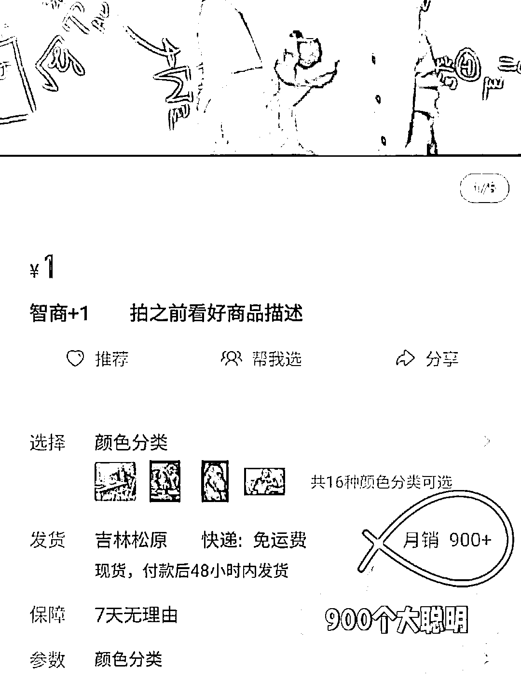
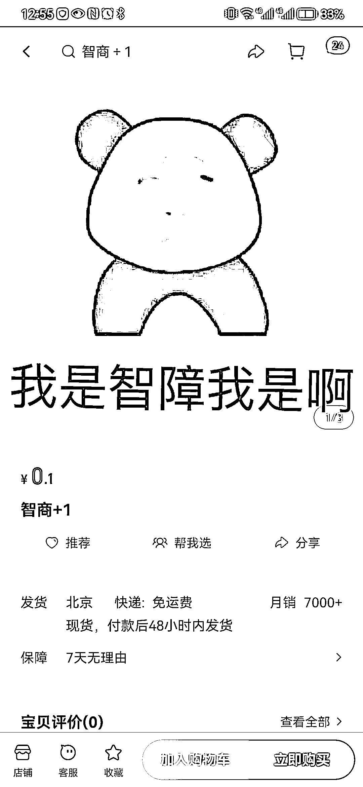
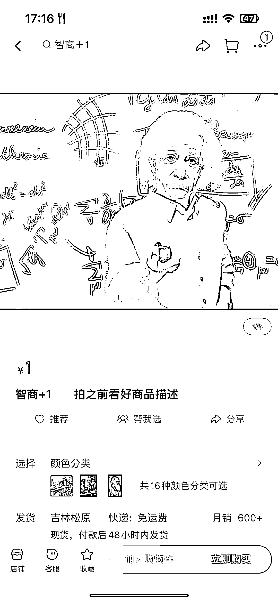
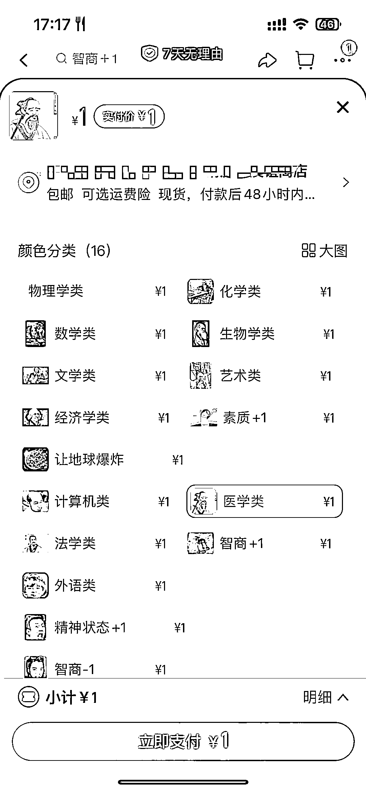

# 淘宝销售祈愿贴

> 原文：[`www.yuque.com/for_lazy/xkrm14/kg3k1dnubm4zvn6a`](https://www.yuque.com/for_lazy/xkrm14/kg3k1dnubm4zvn6a)

作者： 肖

日期：2023-02-23

点赞数：30

<ne-card data-card-name="hr" data-card-type="block" id="MrgbH" data-event-boundary="card">

正文：

美好的祈愿变现？智商+1，那是不是能有桃花+1，财运+1，暴富+1，金钱+1，厄运-1…🤔

<ne-card data-card-name="image" data-card-type="inline" id="gGRhp" data-event-boundary="card">  <ne-p id="u16bd5965" data-lake-id="u16bd5965"><ne-card data-card-name="image" data-card-type="inline" id="smUv6" data-event-boundary="card">  <ne-card data-card-name="hr" data-card-type="block" id="PrTQK" data-event-boundary="card"><ne-p id="u2f190c7f" data-lake-id="u2f190c7f">评论区：

振哥 : 前面有圈友发过这种的😂

肖 : 哦哦，抱歉，没看到😅

<ne-card data-card-name="hr" data-card-type="block" id="lqd1J" data-event-boundary="card">

公众号懒人找资源，懒人专属群分享作者： 小霸王

日期：2023-02-22

点赞数：27

<ne-card data-card-name="hr" data-card-type="block" id="DsOHR" data-event-boundary="card">

正文：

智商+1 同理期末考试某科目分数+10

<ne-card data-card-name="image" data-card-type="inline" id="rz1Ul" data-event-boundary="card">  <ne-p id="uadedb6a4" data-lake-id="uadedb6a4"><ne-card data-card-name="image" data-card-type="inline" id="SKWh2" data-event-boundary="card">  <ne-card data-card-name="hr" data-card-type="block" id="S7VSh" data-event-boundary="card"><ne-p id="u27a67d11" data-lake-id="u27a67d11">评论区：

亦小亮 : 有意思

胡小帅 : 🐂🐂 一字之差

九帆 : 真有意义，万能的淘宝

<ne-card data-card-name="hr" data-card-type="block" id="Y8JMc" data-event-boundary="card">

公众号懒人找资源，懒人专属群分享

</ne-card></ne-card></ne-card></ne-p></ne-card></ne-p></ne-card></ne-card></ne-card></ne-card></ne-p></ne-card></ne-p></ne-card>