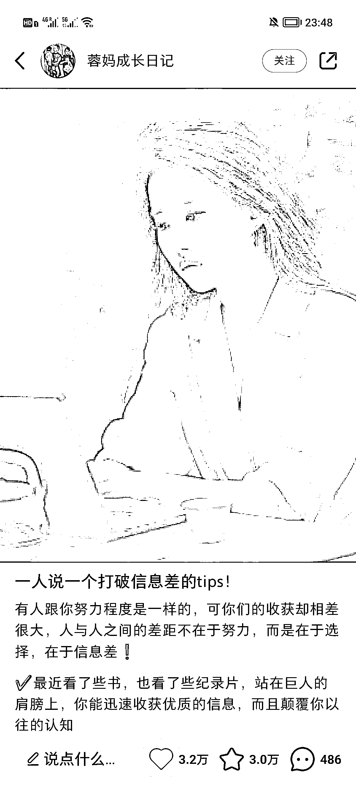
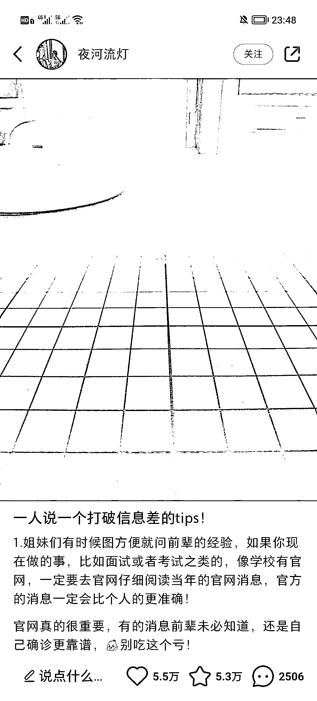
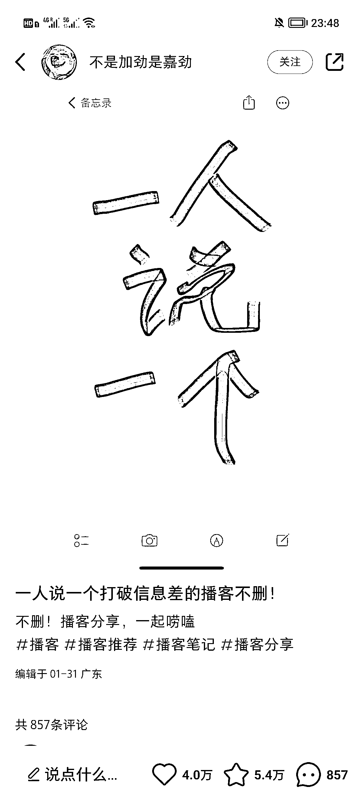
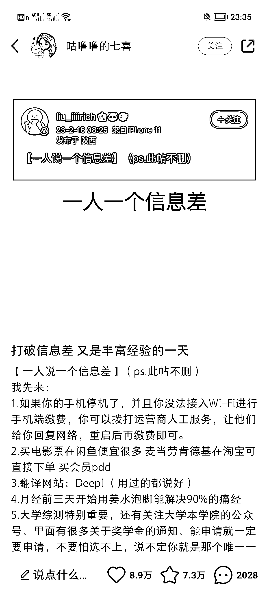
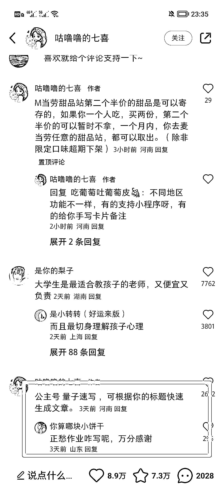

# 小红书同一个爆款标题在不同账号也能大爆

> 原文：[`www.yuque.com/for_lazy/xkrm14/rapr4mfxv8ivf3ax`](https://www.yuque.com/for_lazy/xkrm14/rapr4mfxv8ivf3ax)

<ne-p id="u565f3ea9" data-lake-id="u565f3ea9"><ne-text id="ube87cdc8">作者： 米笠</ne-text></ne-p> <ne-p id="u4c6dd16b" data-lake-id="u4c6dd16b"><ne-text id="u0cfad7e9">日期：2023-02-22</ne-text></ne-p> <ne-p id="uc75fe80b" data-lake-id="uc75fe80b"><ne-text id="uabfe44ba">点赞数：</ne-text><ne-text id="u81b216ef" ne-bold="true">26</ne-text></ne-p> <ne-hole id="u7f2b9e59" data-lake-id="u7f2b9e59"><ne-card data-card-name="hr" data-card-type="block" id="SJzLv" data-event-boundary="card"><ne-p id="u92412912" data-lake-id="u92412912"><ne-text id="ubab20d58">正文：</ne-text></ne-p> <ne-p id="ufd4d7500" data-lake-id="ufd4d7500"><ne-text id="u452e4c14">小红书同一个爆款标题在不同账号也能大爆。 发现这种文案最近也有很多人发 而且都是持续大爆 除此之外 这个爆款的笔记 除了点赞，互动数据好</ne-text> <ne-text id="u64600c04">最后一张图片，作者可以直接通过评论引流到其他平台。</ne-text></ne-p> <ne-p id="u5e02271d" data-lake-id="u5e02271d"><ne-card data-card-name="image" data-card-type="inline" id="gENn2" data-event-boundary="card"></ne-card></ne-p> <ne-p id="u15ecd2e4" data-lake-id="u15ecd2e4"><ne-card data-card-name="image" data-card-type="inline" id="jkp2y" data-event-boundary="card">  <ne-p id="ua2b88f05" data-lake-id="ua2b88f05"><ne-card data-card-name="image" data-card-type="inline" id="MeXgA" data-event-boundary="card"></ne-card></ne-p> <ne-p id="u91f449dc" data-lake-id="u91f449dc"><ne-card data-card-name="image" data-card-type="inline" id="Mf9j6" data-event-boundary="card"></ne-card></ne-p> <ne-p id="u268a7a48" data-lake-id="u268a7a48"><ne-card data-card-name="image" data-card-type="inline" id="P2euv" data-event-boundary="card"></ne-card></ne-p> <ne-p id="u0c25f73f" data-lake-id="u0c25f73f"><ne-card data-card-name="image" data-card-type="inline" id="prYbD" data-event-boundary="card"></ne-card></ne-p> <ne-hole id="u72bcd32f" data-lake-id="u72bcd32f"><ne-card data-card-name="hr" data-card-type="block" id="k6R6o" data-event-boundary="card"><ne-p id="u01943f56" data-lake-id="u01943f56"><ne-text id="u1a9c89dc">评论区：</ne-text></ne-p> <ne-p id="u398c48a8" data-lake-id="u398c48a8"><ne-text id="u0db75360">繁星 : 在抖音也可以玩</ne-text></ne-p> <ne-hole id="ud8800b48" data-lake-id="ud8800b48"><ne-card data-card-name="hr" data-card-type="block" id="jmVyH" data-event-boundary="card"><ne-p id="ued65e3a7" data-lake-id="ued65e3a7"><ne-text id="u14a3f687">公众号懒人找资源，懒人专属群分享</ne-text></ne-p></ne-card></ne-hole></ne-card></ne-hole></ne-card></ne-p></ne-card></ne-hole>