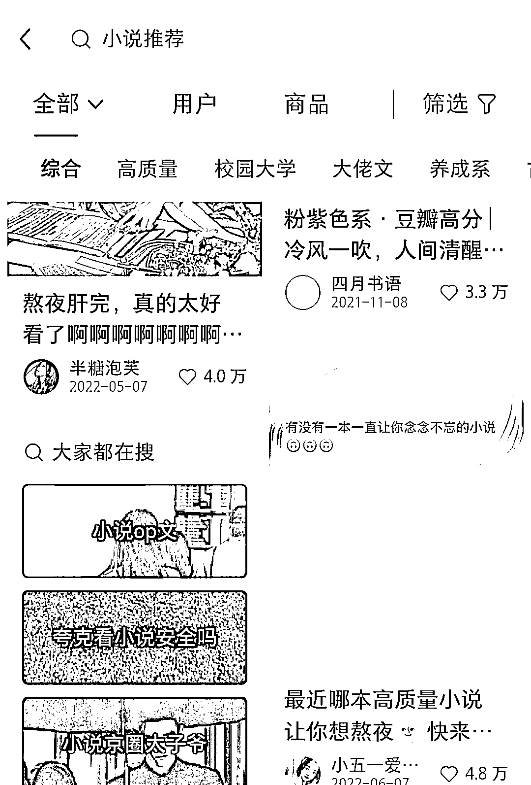

# 在自媒体平台评论截流做小说 CPS

> 原文：[`www.yuque.com/for_lazy/xkrm14/avz0o64phgkde5ln`](https://www.yuque.com/for_lazy/xkrm14/avz0o64phgkde5ln)

作者： 52hz

日期：2023-02-22

点赞数：22

<ne-hole id="uf362670b" data-lake-id="uf362670b"><ne-card data-card-name="hr" data-card-type="block" id="N5Nhx" data-event-boundary="card">

正文：

在做小说推文的每天只需要 10 分钟左右就可以轻松额外多赚到一点小钱的方法，在小红书上面搜索小说推荐，或者知乎小说推荐等搜索词，会出来很多高赞高评论的求小说推荐的帖子。我们可以在评论区评论上自己已经生效的关键词小说，再适当对该小说编辑一下有吸引力的文案，反复复制改文案在不同的求推荐笔记下评论。亲测有效，该方法虽然转化较低，但是用时很少，并且可以多号同时下场评论，基本也能实现每天 10-50 元收益。操作无难度。

<ne-card data-card-name="image" data-card-type="inline" id="ZT455" data-event-boundary="card">  <ne-p id="u1c878daf" data-lake-id="u1c878daf"><ne-card data-card-name="image" data-card-type="inline" id="SNeZM" data-event-boundary="card"></ne-card>

<ne-hole id="u07cacf92" data-lake-id="u07cacf92"><ne-card data-card-name="hr" data-card-type="block" id="E9Cb0" data-event-boundary="card">

评论区：

<ne-hole id="u1ec2f3d7" data-lake-id="u1ec2f3d7"><ne-card data-card-name="hr" data-card-type="block" id="updyc" data-event-boundary="card">

公众号懒人找资源，懒人专属群分享

</ne-card></ne-hole></ne-card></ne-hole></ne-card></ne-p></ne-card></ne-hole>