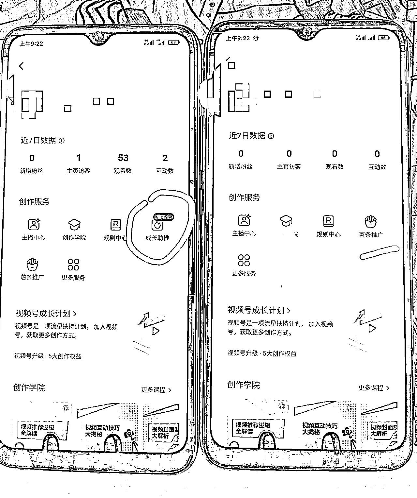

# 判断小红书新号是否正常的方法

> 原文：[`www.yuque.com/for_lazy/xkrm14/pul9bq7dmi720z5q`](https://www.yuque.com/for_lazy/xkrm14/pul9bq7dmi720z5q)

作者： 李地雷

日期：2023-02-22

点赞数：29

<ne-card data-card-name="hr" data-card-type="block" id="GxQKl" data-event-boundary="card">

正文：

判断小红书新号是否正常的小方法，仅供参考哈 发布 2-3 篇笔记后，进入创作者中心，看是否有成长助推功能，有的话基本账号没问题；没有大概率新号有问题的，即便你有观看量可能也是假数据，没有点赞收藏啥的； 我看了自己之前的有问题账号确实没有成长助推

<ne-card data-card-name="image" data-card-type="inline" id="fDGVs" data-event-boundary="card"></ne-card>

<ne-card data-card-name="hr" data-card-type="block" id="BvDhS" data-event-boundary="card">

评论区：

刚刚好 : 两个号都没有“成长助推”，之前出过爆文，后面数据一直一般，原来账号有问题了，感谢

李地雷 : 不客气哦，有用就行呢

<ne-card data-card-name="hr" data-card-type="block" id="aTHob" data-event-boundary="card">

公众号懒人找资源，懒人专属群分享

</ne-card></ne-card></ne-card>