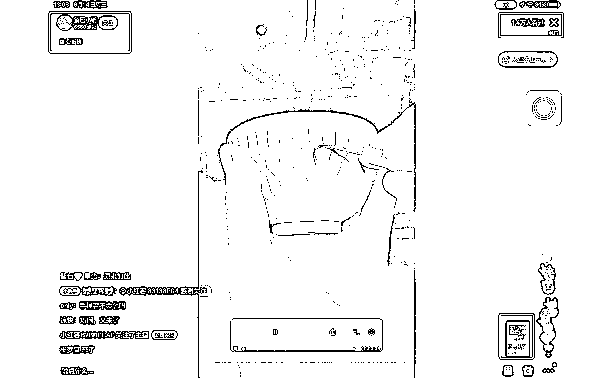
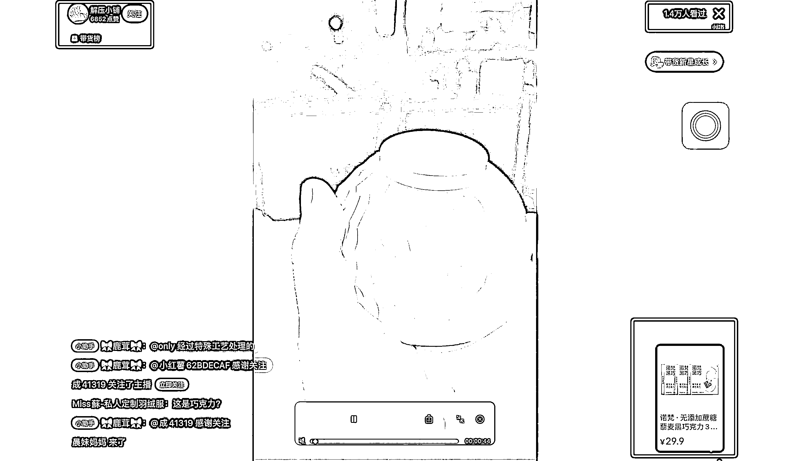

# 小红书的解压小铺，直播做陶泥，互动变现数据好

> 原文：[`www.yuque.com/for_lazy/xkrm14/sgdbtgpf8s0tnfox`](https://www.yuque.com/for_lazy/xkrm14/sgdbtgpf8s0tnfox)

作者： 常常

日期：2023-02-21

点赞数：20

<ne-hole id="u1479dc52" data-lake-id="u1479dc52"><ne-card data-card-name="hr" data-card-type="block" id="GpzL0" data-event-boundary="card">

正文：

小红书的解压小铺，这个直播真的是太猛了， 模式很简单，拿一个类似于陶泥做的碗，直接开直播， 一边手作，一边带货， 中午 12 点开播，开播 1 小时，1.5 万人看过， 直播一边直播一边聊天，带货，观众直接直播间下单， 感兴趣的圈友可以用第三方工具看下后台的带货数据， 主播说是特殊工艺处理过的巧克力，拿在手里不会化， 让人觉得很专业，个人觉得他手里的碗个人是陶泥。 这种视频看了真的很解压，直播间配的背景音乐是直播的精髓， 直播间的背景音乐关了一会，粉丝直接掉了几百，但是知识星球风向标不能发视频。。。 同样的模式可以放在抖音或者其他平台上玩一遍。

<ne-card data-card-name="image" data-card-type="inline" id="tDUQM" data-event-boundary="card">  <ne-p id="uc147107c" data-lake-id="uc147107c"><ne-card data-card-name="image" data-card-type="inline" id="eX1eT" data-event-boundary="card">  <ne-hole id="u46f287a6" data-lake-id="u46f287a6"><ne-card data-card-name="hr" data-card-type="block" id="mbU8h" data-event-boundary="card"><ne-p id="u2a61ae38" data-lake-id="u2a61ae38">评论区：

Fredrich : 这个是录播，从 tiktok 到油管，抖音，快手，基本上同一个视频，同样的还有一个用牙膏刷鹌鹑蛋的视频

常常 : 我看的时候还真不是，因为主播一直在回复评论区的用户，用户的评论都是实时的😂

Fredrich : 嗯，有可能是真实场景，不过录播+半无人一样解决你说的场景，参见生财往期半无人直播训练营

<ne-hole id="u80bcf3c8" data-lake-id="u80bcf3c8"><ne-card data-card-name="hr" data-card-type="block" id="DakFq" data-event-boundary="card">

公众号懒人找资源，懒人专属群分享

</ne-card></ne-hole></ne-card></ne-hole></ne-card></ne-p></ne-card></ne-p></ne-card></ne-hole>