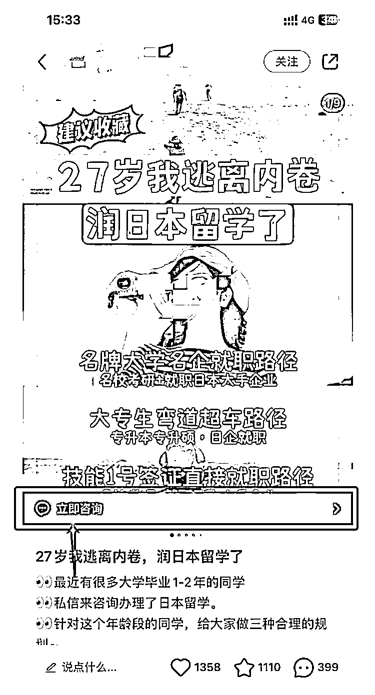

# 小红书付费投放案例

> 原文：[`www.yuque.com/for_lazy/xkrm14/wizoo4r25h7st3bf`](https://www.yuque.com/for_lazy/xkrm14/wizoo4r25h7st3bf)

<ne-p id="u887f8f2c" data-lake-id="u887f8f2c"><ne-text id="u38d19922">作者： 王马扎</ne-text></ne-p> <ne-p id="udd50500d" data-lake-id="udd50500d"><ne-text id="ucbd7ab63">日期：2023-02-21</ne-text></ne-p> <ne-p id="ub69ba5d9" data-lake-id="ub69ba5d9"><ne-text id="u9857c584">点赞数：</ne-text><ne-text id="u212aae58" ne-bold="true">15</ne-text></ne-p> <ne-hole id="u1bd42d04" data-lake-id="u1bd42d04"><ne-card data-card-name="hr" data-card-type="block" id="wNrbu" data-event-boundary="card"><ne-p id="ubcf79c0c" data-lake-id="ubcf79c0c"><ne-text id="ucbf13b77">正文：</ne-text></ne-p> <ne-p id="u01d68ba6" data-lake-id="u01d68ba6"><ne-text id="u66aa4bc9">小红书付费投放案例</ne-text> <ne-text id="u8988eeb4">如图中所示，是一个小红书留学咨询付费投放笔记，比较明显的一点是封面下方有“立即咨询”，用户可以通过点击立即咨询直接与博主私信沟通，转化到私域非常顺滑。</ne-text> <ne-text id="ub76f5362">问了一下，目前小红书投放费用： 开户：1w（预充值） 投放：每次点击 0.35 元（职场领域），这个价格挺便宜的，与知乎差不多</ne-text></ne-p> <ne-p id="ucc65a99d" data-lake-id="ucc65a99d"><ne-card data-card-name="image" data-card-type="inline" id="RpVr4" data-event-boundary="card">  <ne-hole id="u654ff44d" data-lake-id="u654ff44d"><ne-card data-card-name="hr" data-card-type="block" id="b0yKc" data-event-boundary="card"><ne-p id="u3f7385bc" data-lake-id="u3f7385bc"><ne-text id="u3122f646">评论区：</ne-text></ne-p> <ne-p id="u375c6ded" data-lake-id="u375c6ded"><ne-text id="u1c7369a0">李茶 de : 转化比怎么样</ne-text></ne-p> <ne-hole id="u8392e74e" data-lake-id="u8392e74e"><ne-card data-card-name="hr" data-card-type="block" id="gsWWo" data-event-boundary="card"><ne-p id="u8e0f4340" data-lake-id="u8e0f4340"><ne-text id="u6b29f7cd">公众号懒人找资源，懒人专属群分享</ne-text></ne-p></ne-card></ne-hole></ne-card></ne-hole></ne-card></ne-p></ne-card></ne-hole>