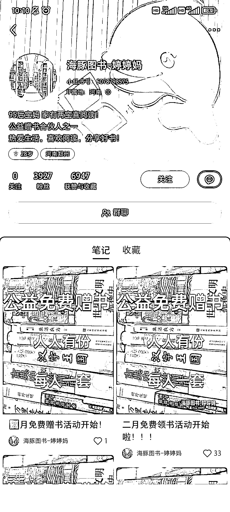
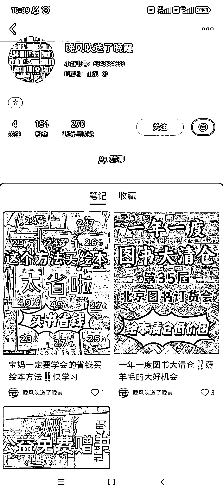
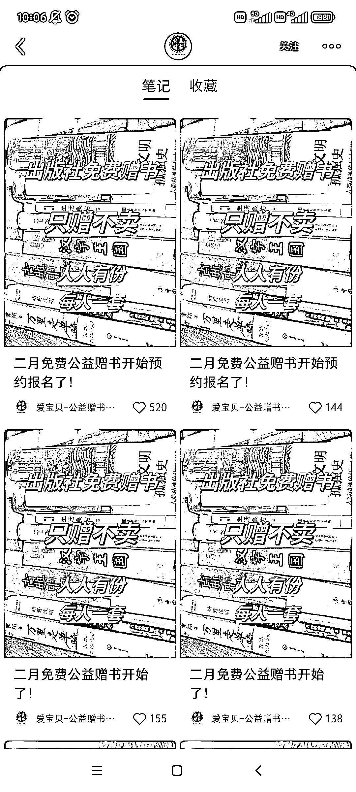
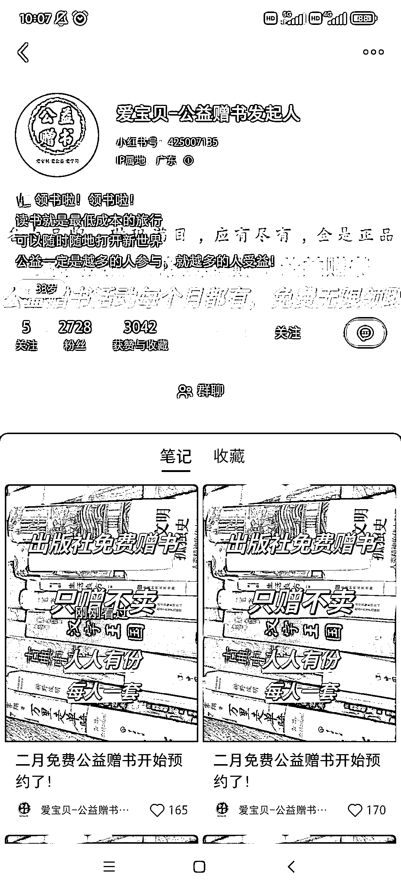
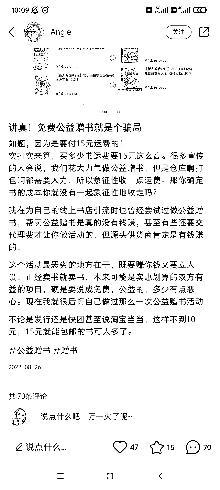

# 小红书公益赠书玩法分析

> 原文：[`www.yuque.com/for_lazy/xkrm14/itgor6nsh4ko92hq`](https://www.yuque.com/for_lazy/xkrm14/itgor6nsh4ko92hq)

<ne-p id="u571944ed" data-lake-id="u571944ed"><ne-text id="ua5abb2e6">作者： 阿黎</ne-text></ne-p> <ne-p id="uf91e2eb7" data-lake-id="uf91e2eb7"><ne-text id="u5b3381ab">日期：2023-02-21</ne-text></ne-p> <ne-p id="uf52c9504" data-lake-id="uf52c9504"><ne-text id="ud628fc74">点赞数：</ne-text><ne-text id="ub95fbcf5" ne-bold="true">16</ne-text></ne-p> <ne-hole id="u29208696" data-lake-id="u29208696"><ne-card data-card-name="hr" data-card-type="block" id="yzKDX" data-event-boundary="card"><ne-p id="u16085a79" data-lake-id="u16085a79"><ne-text id="uee062f24">正文：</ne-text></ne-p> <ne-p id="u3897e5e6" data-lake-id="u3897e5e6"><ne-text id="u30276a03">小红书上频繁刷到 公益赠书 ，付费 15 元，送你一套书，开盲盒。(我觉得，对应的，再往上的玩法，就是 keep 跑步买奖章了)</ne-text> <ne-text id="u427fdf36">公益赠书，引流的大多都是新号，而且不光同个账号就是重复怼一样的笔记(图都一样那种，居然没触发风控，看来只要有自然互动就会推流)，而且不同账号都用同一个图!</ne-text> <ne-text id="u7add390a">初步看了一下，有好多账号说公益赠书的反馈，大概有两种玩法 一种是粉丝收到的书，不值 15 元，从书里赚差价</ne-text> <ne-text id="ub64cea35">一种是差不多值 15 元，不在书上赚钱，靠 0 元引流加社群，做二次变现</ne-text> <ne-text id="u95f8f413">主要是，这个玩法简单粗暴，而且依然有很大的量，算是资料引流的一种升级，把书换成其他对应目标人群喜欢的东西，加上公益、盲盒的元素，闭环也是成立的</ne-text></ne-p> <ne-p id="u455f41e1" data-lake-id="u455f41e1"><ne-card data-card-name="image" data-card-type="inline" id="xtzuG" data-event-boundary="card"></ne-card></ne-p> <ne-p id="u2aa4396c" data-lake-id="u2aa4396c"><ne-card data-card-name="image" data-card-type="inline" id="QHUMY" data-event-boundary="card"></ne-card></ne-p> <ne-p id="u1b6e5094" data-lake-id="u1b6e5094"><ne-card data-card-name="image" data-card-type="inline" id="S3D9k" data-event-boundary="card"></ne-card></ne-p> <ne-p id="u430a55bb" data-lake-id="u430a55bb"><ne-card data-card-name="image" data-card-type="inline" id="sA7Zj" data-event-boundary="card"></ne-card></ne-p> <ne-p id="ufaaa4bda" data-lake-id="ufaaa4bda"><ne-card data-card-name="image" data-card-type="inline" id="e1wKG" data-event-boundary="card"></ne-card></ne-p> <ne-p id="u17787f9d" data-lake-id="u17787f9d"><ne-card data-card-name="image" data-card-type="inline" id="NA34A" data-event-boundary="card"></ne-card></ne-p> <ne-p id="u14de517e" data-lake-id="u14de517e"><ne-card data-card-name="image" data-card-type="inline" id="AeKMK" data-event-boundary="card"></ne-card></ne-p> <ne-p id="ua296bb3d" data-lake-id="ua296bb3d"><ne-card data-card-name="image" data-card-type="inline" id="iabwH" data-event-boundary="card"></ne-card></ne-p> <ne-hole id="u6b1f178f" data-lake-id="u6b1f178f"><ne-card data-card-name="hr" data-card-type="block" id="kxDAO" data-event-boundary="card"><ne-p id="uf6f56b22" data-lake-id="uf6f56b22"><ne-text id="ueff365a1">评论区：</ne-text></ne-p> <ne-hole id="udec89294" data-lake-id="udec89294"><ne-card data-card-name="hr" data-card-type="block" id="YPnfA" data-event-boundary="card"><ne-p id="u42de4217" data-lake-id="u42de4217"><ne-text id="u12d7ec07">公众号懒人找资源，懒人专属群分享</ne-text></ne-p></ne-card></ne-hole></ne-card></ne-hole></ne-card></ne-hole>