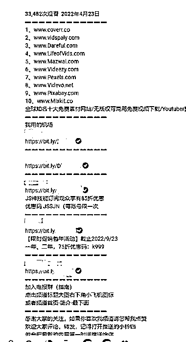

# 海外域名、主机、软件 CPS 变现思路

> 原文：[`www.yuque.com/for_lazy/xkrm14/wqdpuz9uhgxl4wv2`](https://www.yuque.com/for_lazy/xkrm14/wqdpuz9uhgxl4wv2)

作者： 米笠

日期：2023-02-23

点赞数：26

<ne-hole id="uf83b8031" data-lake-id="uf83b8031"><ne-card data-card-name="hr" data-card-type="block" id="C8eOV" data-event-boundary="card">

正文：

海外域名、主机、软件 CPS 变现思路 在 B 站和 youtube 做软件科普博主 每期推荐实用的软件集合内容 盈利方式，除了流量分成之外 大部分通过推荐空间、域名、软件等 CPS 方式盈利。 尤其是国外网站的 CPS，佣金甚至超过用户付款金额。

<ne-card data-card-name="image" data-card-type="inline" id="jbF1p" data-event-boundary="card">  <ne-p id="u3702608a" data-lake-id="u3702608a"><ne-card data-card-name="image" data-card-type="inline" id="ymDTl" data-event-boundary="card">  <ne-hole id="ud0b48622" data-lake-id="ud0b48622"><ne-card data-card-name="hr" data-card-type="block" id="ORhos" data-event-boundary="card"><ne-p id="uae0da5cb" data-lake-id="uae0da5cb">评论区：

<ne-hole id="u7574717b" data-lake-id="u7574717b"><ne-card data-card-name="hr" data-card-type="block" id="nRKov" data-event-boundary="card">

公众号懒人找资源，懒人专属群分享

</ne-card></ne-hole></ne-card></ne-hole></ne-card></ne-p></ne-card></ne-p></ne-card></ne-hole>