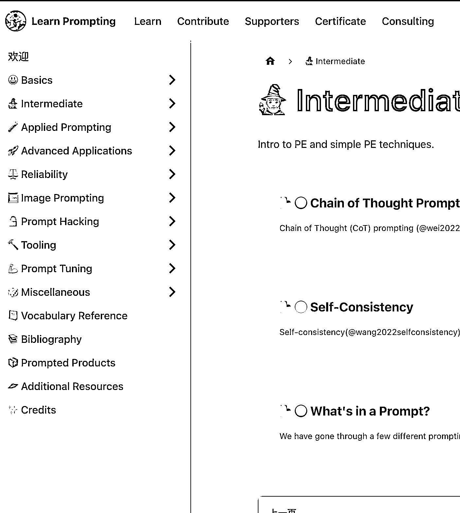

# 系统学习 prompt 使用的教程，包括 AI 绘图和 Chatgpt 的 prompt

> 原文：[`www.yuque.com/for_lazy/xkrm14/gp2e640760e0znot`](https://www.yuque.com/for_lazy/xkrm14/gp2e640760e0znot)

<ne-p id="ubfa8bd25" data-lake-id="ubfa8bd25"><ne-text id="ua681b879">作者： seewhy</ne-text></ne-p> <ne-p id="ua4382b27" data-lake-id="ua4382b27"><ne-text id="uab5a8d9b">日期：2023-02-20</ne-text></ne-p> <ne-p id="u5fa8fcf5" data-lake-id="u5fa8fcf5"><ne-text id="u62aa81d3">点赞数：</ne-text><ne-text id="ucdfde8d5" ne-bold="true">22</ne-text></ne-p> <ne-hole id="u772562cd" data-lake-id="u772562cd"><ne-card data-card-name="hr" data-card-type="block" id="lFOZL" data-event-boundary="card"><ne-p id="u97bf4915" data-lake-id="u97bf4915"><ne-text id="u62f20bd7">正文：</ne-text></ne-p> <ne-p id="u73ab8fe7" data-lake-id="u73ab8fe7"><ne-text id="u6eef0e33">一份系统学习 prompt 使用的教程，包括 AI 绘图和 Chatgpt 的 prompt。</ne-text> [<ne-text id="u3b5fad0a">欢迎+|+Learn+Prompting</ne-text>](https://learnprompting.org/zh-Hans/docs/intro)</ne-p> <ne-p id="ud6183c22" data-lake-id="ud6183c22"><ne-card data-card-name="image" data-card-type="inline" id="Ton8X" data-event-boundary="card">  <ne-hole id="u30e86b62" data-lake-id="u30e86b62"><ne-card data-card-name="hr" data-card-type="block" id="GCb7J" data-event-boundary="card"><ne-p id="u31d1d37c" data-lake-id="u31d1d37c"><ne-text id="u789aff34">评论区：</ne-text></ne-p> <ne-hole id="u511e5b47" data-lake-id="u511e5b47"><ne-card data-card-name="hr" data-card-type="block" id="mfhBW" data-event-boundary="card"><ne-p id="u2d9a1838" data-lake-id="u2d9a1838"><ne-text id="u378d6238">公众号懒人找资源，懒人专属群分享</ne-text></ne-p></ne-card></ne-hole></ne-card></ne-hole></ne-card></ne-p></ne-card></ne-hole>