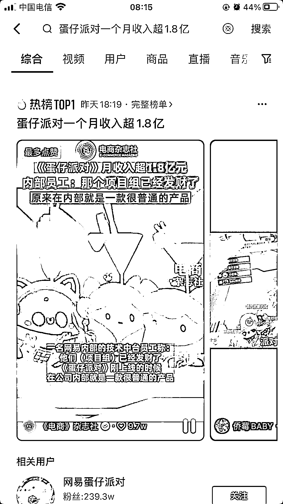

# 《蛋仔派对》游戏火热，可参考羊了个羊玩法提前布局相关周边

> 原文：[`www.yuque.com/for_lazy/xkrm14/iu6e6e3xu7h6oqoo`](https://www.yuque.com/for_lazy/xkrm14/iu6e6e3xu7h6oqoo)

作者： 好六

日期：2023-02-24

点赞数：60

<ne-hole id="ud5031a35" data-lake-id="ud5031a35"><ne-card data-card-name="hr" data-card-type="block" id="plZfe" data-event-boundary="card">

正文：

月收入超 1.8 亿元，趁《蛋仔派对》这款游戏还没有成为下个：王者荣耀，提前布局攻略、教程、短视频、卖装备、卖账号等相关玩法，小白可以在生财搜“羊了个羊”的所有玩法，直接复制执行力拉满，成绩只是时间问题。

<ne-card data-card-name="image" data-card-type="inline" id="ifuKe" data-event-boundary="card"></ne-card>

<ne-hole id="u33368407" data-lake-id="u33368407"><ne-card data-card-name="hr" data-card-type="block" id="Mnbz3" data-event-boundary="card">

评论区：

少儿探索科学实验室 : 这个游戏应该会火起来，我儿子一直在玩这个，二年级 还带动了挺多同学一起玩，就连他哥哥，初三了，都被他带着喜欢上了这款游戏

好六 : 对，已经试完了，早晚的事

少儿探索科学实验室 : 我家老二现在好像已经是什么恐龙蛋了，这 1.8 亿里面，也没少有他充值贡献的

好六 : 哈哈，干吧

无极 : 我家的小子也玩这个带着身边不少同学一起玩

<ne-hole id="u2e6d6819" data-lake-id="u2e6d6819"><ne-card data-card-name="hr" data-card-type="block" id="w2SVk" data-event-boundary="card">

公众号懒人找资源，懒人专属群分享

</ne-card></ne-hole></ne-card></ne-hole></ne-card></ne-hole>