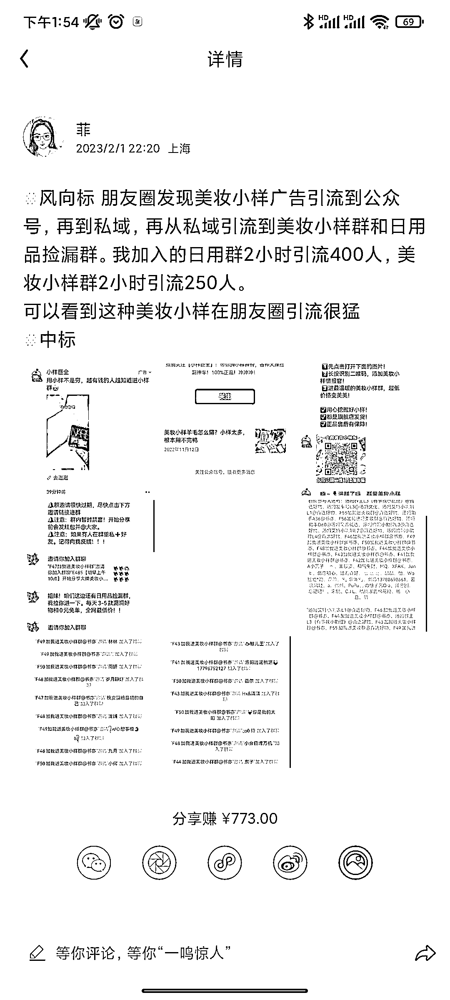
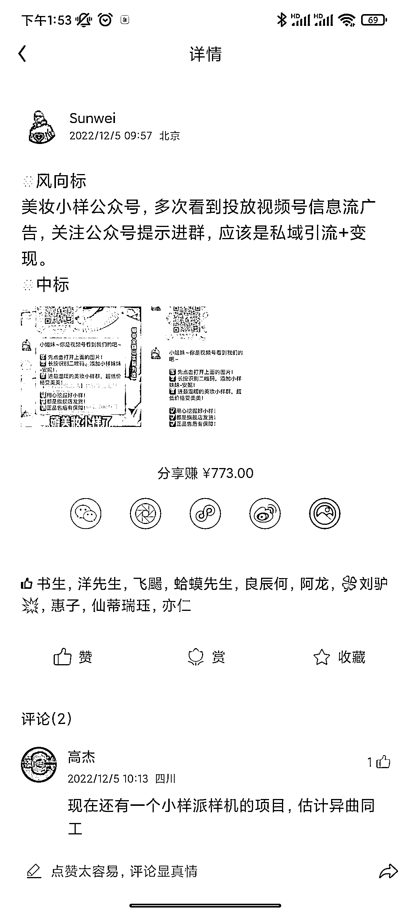

# 化妆品小样信息差操作思路

> 原文：[`www.yuque.com/for_lazy/xkrm14/bp9tan7cta1bgh08`](https://www.yuque.com/for_lazy/xkrm14/bp9tan7cta1bgh08)

<ne-p id="ufc10b8e8" data-lake-id="ufc10b8e8"><ne-text id="u96a5a3a8">作者： 零</ne-text></ne-p> <ne-p id="u016772ae" data-lake-id="u016772ae"><ne-text id="ubc9c4aab">日期：2023-02-22</ne-text></ne-p> <ne-p id="u94c6d4b5" data-lake-id="u94c6d4b5"><ne-text id="u4bcfac60">点赞数：</ne-text><ne-text id="u0a3185da" ne-bold="true">17</ne-text></ne-p> <ne-hole id="ub48ebc69" data-lake-id="ub48ebc69"><ne-card data-card-name="hr" data-card-type="block" id="R132j" data-event-boundary="card"><ne-p id="u65f7a696" data-lake-id="u65f7a696"><ne-text id="ud56fcbce">正文：</ne-text></ne-p> <ne-p id="ubf579c4a" data-lake-id="ubf579c4a"><ne-text id="u0fb5769e">在风向标看见很多，小样社群引流的消息。圈友们说的拉新啊引流啊也都存在。不过对于品牌最主要的目的是“消库存”，以我自己所在的资开头的美妆店为例，每年每个品都会有几万支的小、中样给运营用做各种活动，这些样品我们只要卖个快递费就行，所以价差就来了。</ne-text> <ne-text id="u710db820">今天分享一个自用找小样的办法 1.小样社群，不过做社群既然用了信息差，加不加价就不知道了。</ne-text> <ne-text id="u12644cab">2.淘宝店铺，搜直播间，翻看这个品是不是常年变了法子送样品，如果有蛮大概率品牌也是不计小样费用的，然后就淘宝搜 XX 品小样或者闲鱼，你就会找到远低于市场价价值的产品了。（自己亲测几个美妆产品是管用的还没遇见假货啥的，不过也有风险大家自行判断）</ne-text></ne-p> <ne-p id="ud39ae958" data-lake-id="ud39ae958"><ne-card data-card-name="image" data-card-type="inline" id="w5ecu" data-event-boundary="card">  <ne-p id="u9465f2c3" data-lake-id="u9465f2c3"><ne-card data-card-name="image" data-card-type="inline" id="ShwQz" data-event-boundary="card">  <ne-hole id="uf2e333f9" data-lake-id="uf2e333f9"><ne-card data-card-name="hr" data-card-type="block" id="WV6Lf" data-event-boundary="card"><ne-p id="u77c6c389" data-lake-id="u77c6c389"><ne-text id="ua451f10f">评论区：</ne-text></ne-p> <ne-hole id="u191b87f7" data-lake-id="u191b87f7"><ne-card data-card-name="hr" data-card-type="block" id="lUGMG" data-event-boundary="card"><ne-p id="u2e5776b3" data-lake-id="u2e5776b3"><ne-text id="uc1babfff">公众号懒人找资源，懒人专属群分享</ne-text></ne-p></ne-card></ne-hole></ne-card></ne-hole></ne-card></ne-p></ne-card></ne-p></ne-card></ne-hole>