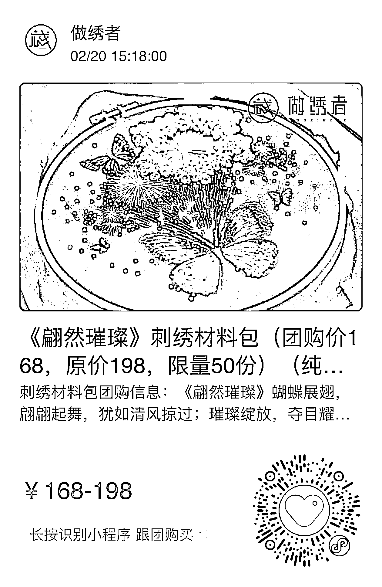

# 新奇特产品如 AI 绘画刺绣，多平台有资源扶持

> 原文：[`www.yuque.com/for_lazy/xkrm14/pfw76mk66qfl9to3`](https://www.yuque.com/for_lazy/xkrm14/pfw76mk66qfl9to3)

作者： 清华

日期：2023-02-20

点赞数：60

正文：

新奇特的产品一直引人注目，连平台都会帮你推。 还是我的 AI 绘画。画的刺绣，受到了 当代人民艺术家的青睐，亲自帮我研发出刺绣成品。然后，今天上快团团链接，我顺这个销路通挖掘下去，过两位圈友的推荐发展出两条路线。 一个是找到供应链，对方还没做个此产品，尝试帮推。第二，拼多多的跨境 Temu 平台，也没有上过此品，说都可以给资源。 如果你的产品够新奇特的，那你也可以尝试尝试。可以多平台尝试。特别是你的产品新奇特，质量有好，客单价有高，那更应该了。 我的 AI 刺绣变成了实物刺绣也验证了之前的从 AI 绘画到实物变现这条链路，且跟商家合作的话，可以拿提成的，就是每卖一单，都能有一份的收入。

评论区：

公众号懒人找资源，懒人专属群分享

