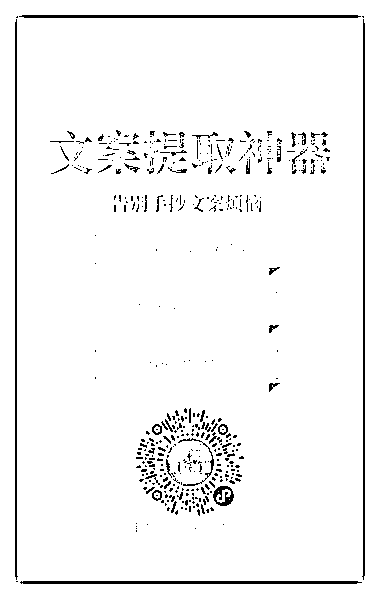
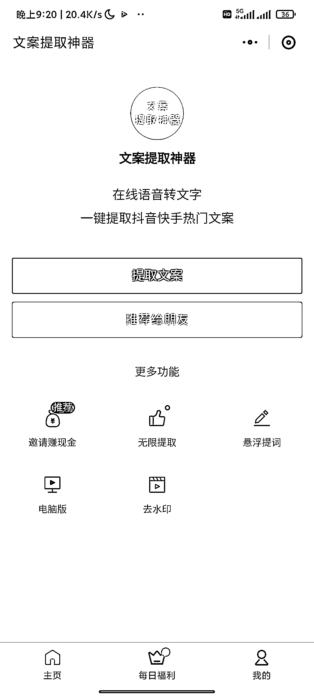

# 文案提取小程序有分销功能

> 原文：[`www.yuque.com/for_lazy/xkrm14/qr0mn7kkawnrlfgi`](https://www.yuque.com/for_lazy/xkrm14/qr0mn7kkawnrlfgi)

作者： Kylin

日期：2023-02-23

点赞数：23

<ne-card data-card-name="hr" data-card-type="block" id="xmH8L" data-event-boundary="card">

正文：

文案提取小程序分销 背景：在轻抖提取 B 站视频文案的时候，因为视频文件太大，不能提取。在微信里搜索的时候，发现了下图中显示文案提取的小程序。目前我提取的视频长度最长是十分钟左右。 使用过程：首次可免费使用一次，每日可通过签到领取 1 金币，来免费提取一次。提取后的文案需要校准，内容多的话，会遗漏几句。邀请别人可以获取分佣之类的。付费的价格没有对比，我也不造性价比咋样，有过研究的圈友可以分享下。 它们有个单门的页面展示分销人的获益，不知道真的假的，不过小红书有那么多分享工具的账号，也可以通过这种方式分享来获取收益 小程序的功能设置简单明了，不造咱们圈友有木有开发的，需求量应该挺大，因为看到联系他们客服的那个浏览页面的人挺多[捂脸]

<ne-card data-card-name="image" data-card-type="inline" id="L05D4" data-event-boundary="card">  <ne-p id="ufa480382" data-lake-id="ufa480382"><ne-card data-card-name="image" data-card-type="inline" id="ev165" data-event-boundary="card"></ne-card>

<ne-card data-card-name="image" data-card-type="inline" id="qbbfr" data-event-boundary="card"></ne-card>

<ne-card data-card-name="image" data-card-type="inline" id="MGmHP" data-event-boundary="card"></ne-card>

<ne-card data-card-name="hr" data-card-type="block" id="nqT0H" data-event-boundary="card">

评论区：

<ne-card data-card-name="hr" data-card-type="block" id="LNvmI" data-event-boundary="card">

公众号懒人找资源，懒人专属群分享

</ne-card></ne-card></ne-card></ne-p></ne-card>