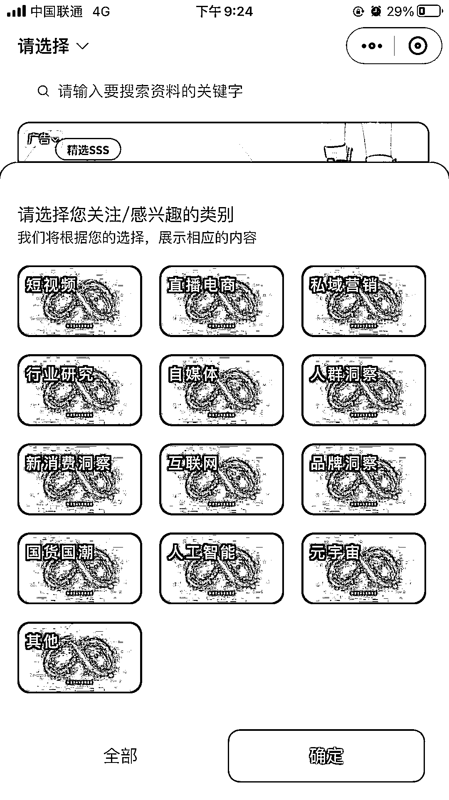
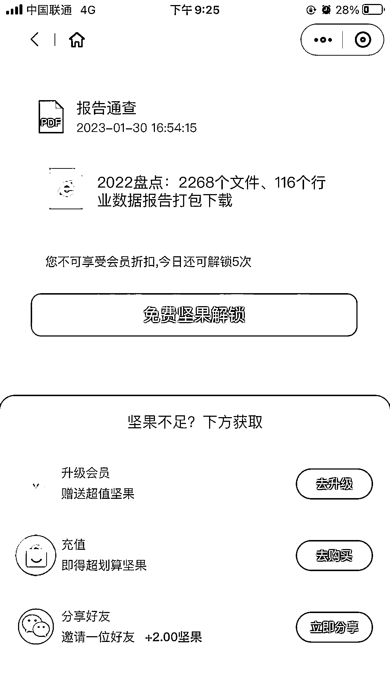
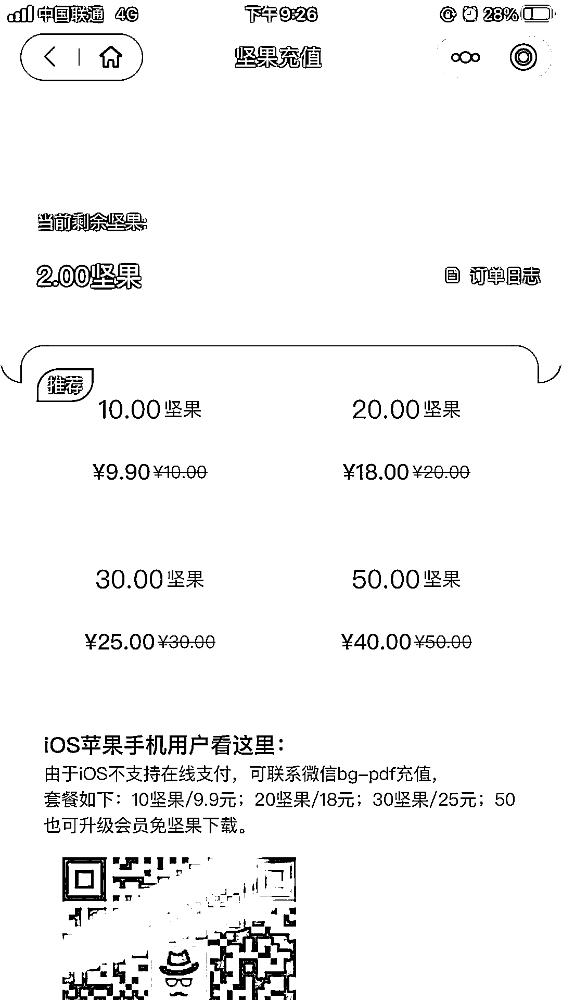

# 垂直的行业学报，公众号引流，小程序充值付费下载

> 原文：[`www.yuque.com/for_lazy/xkrm14/eb9px7ei5rwo44yh`](https://www.yuque.com/for_lazy/xkrm14/eb9px7ei5rwo44yh)

<ne-p id="u255cb54e" data-lake-id="u255cb54e"><ne-text id="uf7b04c27">作者： 海绵践行</ne-text></ne-p> <ne-p id="ud2ce3619" data-lake-id="ud2ce3619"><ne-text id="u35cc142f">日期：2023-02-21</ne-text></ne-p> <ne-p id="u0d79cf16" data-lake-id="u0d79cf16"><ne-text id="uc1d8456e">点赞数：</ne-text><ne-text id="u1c4a9134" ne-bold="true">18</ne-text></ne-p> <ne-hole id="ua2d22f90" data-lake-id="ua2d22f90"><ne-card data-card-name="hr" data-card-type="block" id="Mv0XA" data-event-boundary="card"><ne-p id="uf112f08e" data-lake-id="uf112f08e"><ne-text id="u74f251dc">正文：</ne-text></ne-p> <ne-p id="ub3d7501c" data-lake-id="ub3d7501c"><ne-text id="udabafa52">顺着圈友发的小红书月报风向标搜索，发现了一个垂直的行业学报公众号+小程序 公众号引流，小程序充值付费下载 点进去看到了不少行业（包括小红书的）</ne-text> <ne-text id="uf321c217">1 份报告 2～3 元 微信搜一搜很靠前，预计收入应该挺好的（不太懂）</ne-text></ne-p> <ne-p id="uc7bf3bde" data-lake-id="uc7bf3bde"><ne-card data-card-name="image" data-card-type="inline" id="VRKQH" data-event-boundary="card"></ne-card></ne-p> <ne-p id="u0176ed1e" data-lake-id="u0176ed1e"><ne-card data-card-name="image" data-card-type="inline" id="Thfzk" data-event-boundary="card"></ne-card></ne-p> <ne-p id="u182decf2" data-lake-id="u182decf2"><ne-card data-card-name="image" data-card-type="inline" id="AkTqx" data-event-boundary="card"></ne-card></ne-p> <ne-p id="u3fee010a" data-lake-id="u3fee010a"><ne-card data-card-name="image" data-card-type="inline" id="hFd71" data-event-boundary="card"></ne-card></ne-p> <ne-p id="u2807d4fc" data-lake-id="u2807d4fc"><ne-card data-card-name="image" data-card-type="inline" id="Sikid" data-event-boundary="card"></ne-card></ne-p> <ne-p id="uc256485e" data-lake-id="uc256485e"><ne-card data-card-name="image" data-card-type="inline" id="bsBab" data-event-boundary="card"></ne-card></ne-p> <ne-hole id="u8b8c1a2f" data-lake-id="u8b8c1a2f"><ne-card data-card-name="hr" data-card-type="block" id="w8jQ5" data-event-boundary="card"><ne-p id="u19adf223" data-lake-id="u19adf223"><ne-text id="u371101e7">评论区：</ne-text></ne-p> <ne-p id="uf7ad8d14" data-lake-id="uf7ad8d14"><ne-text id="u292c6493">深蓝 blue : 叫啥呀</ne-text></ne-p> <ne-p id="ufb463116" data-lake-id="ufb463116"><ne-text id="u879acda3">海绵践行 : 小程序叫：报告通查</ne-text></ne-p> <ne-hole id="u492d094d" data-lake-id="u492d094d"><ne-card data-card-name="hr" data-card-type="block" id="R0r6t" data-event-boundary="card"><ne-p id="u3b71791b" data-lake-id="u3b71791b"><ne-text id="u4600a2d6">公众号懒人找资源，懒人专属群分享</ne-text></ne-p></ne-card></ne-hole></ne-card></ne-hole></ne-card></ne-hole>