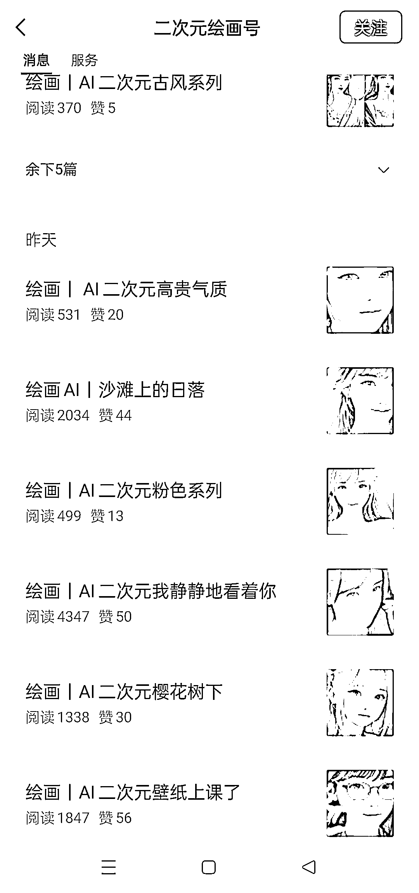
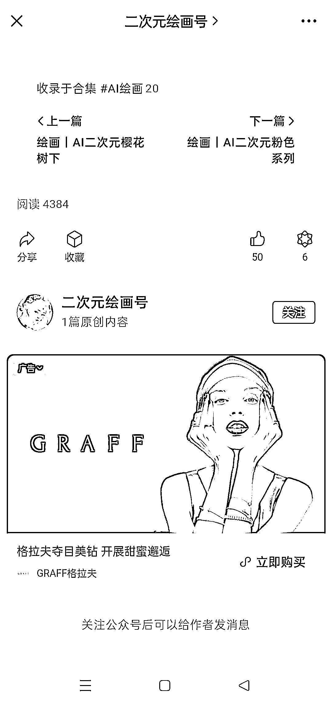
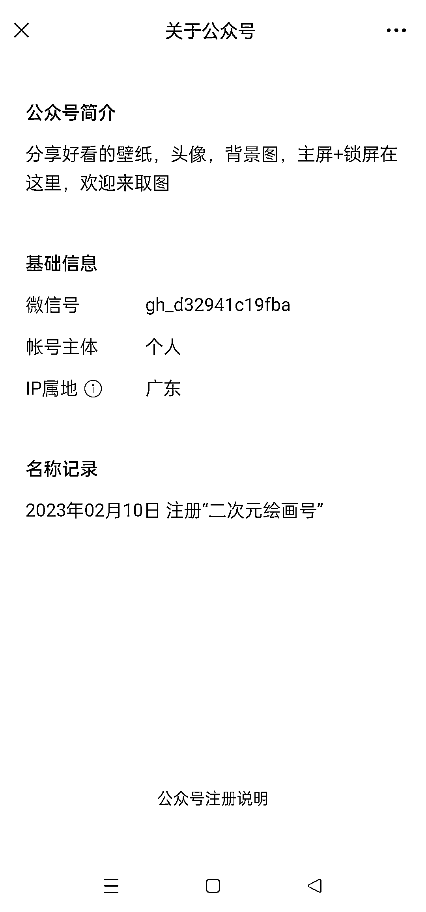

# AI 绘画+公众号，广告主变现

> 原文：[`www.yuque.com/for_lazy/xkrm14/lfb7g8vunpuqqu57`](https://www.yuque.com/for_lazy/xkrm14/lfb7g8vunpuqqu57)

作者： 奇点

日期：2023-02-21

点赞数：29

<ne-card data-card-name="hr" data-card-type="block" id="eFkUZ" data-event-boundary="card">

正文：

AI 绘画+公众号，广告主变现。 图片里的公众号 2 月 10 号注册的，每篇文章就是发的几张 AI 生成的图片，阅读量最高有 4000+，关键是每天发了 8 条文章。

<ne-card data-card-name="image" data-card-type="inline" id="lGKyy" data-event-boundary="card"></ne-card>

<ne-card data-card-name="image" data-card-type="inline" id="P3RUx" data-event-boundary="card"></ne-card>

<ne-card data-card-name="image" data-card-type="inline" id="emOL0" data-event-boundary="card"></ne-card>

<ne-card data-card-name="hr" data-card-type="block" id="XkOVe" data-event-boundary="card">

评论区：

振哥 : 不知道是纯自然流量还是有引流过去？图确实挺好看的[强]

<ne-card data-card-name="hr" data-card-type="block" id="wDad4" data-event-boundary="card">

公众号懒人找资源，懒人专属群分享

</ne-card></ne-card></ne-card>