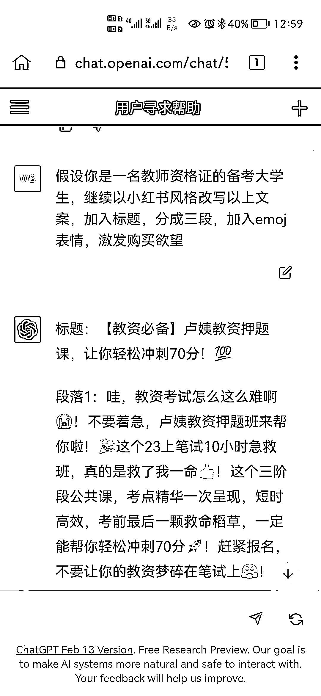
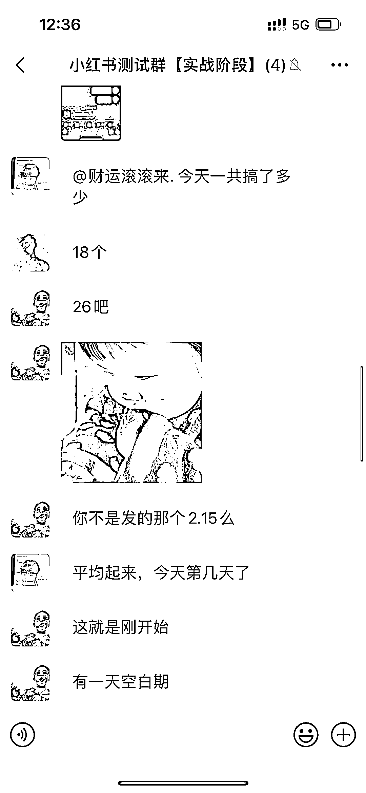

# 通过做玩赚 ChatGPT 社群，分享赚钱思路

> 原文：[`www.yuque.com/for_lazy/xkrm14/wchcofd8gnyqdexb`](https://www.yuque.com/for_lazy/xkrm14/wchcofd8gnyqdexb)

作者： 凡灵逸尘

日期：2023-02-17

点赞数：78

正文：

分享一个思路给大家，近期在做玩赚 ChatGPT 社群，在项目开始的第二天晚上，我们工作室其他两个项目的负责人同时给我说，项目跑通了。 开心是肯定的，但是也苦恼，因为玩 ChatGPT 社群当晚也爆火，使得我根本分身乏术，工作室的项目基本顾不上，只能给思路和执行方案，同时让我另外一个合伙人赶回来协助我。 目前其中一个小红书引流项目正在放大阶段，但是矩阵化，文案编写是一个问题，因为固有的模板矩阵同质化会导致账号风控问题，他们没有太多的时间去写文案，首先不专业，其次控的账号太多。 不过前两天看到玩赚 ChatGPtT 社群有个用户分享他用 chatGPT 写文案的场景，所以昨天吃饭的空闲时间，给负责小红书板块的伙计分享一下玩法。 通过 ChatGPT 编写小红书引流文案，在细分领域引流贼猛，目前一个号单天引流 10-30 个粉丝，而且通过我们玩赚 ChatGPT 负责产品模块的负责人教的调教方式，使得效率贼高。 这个是近一周的真实案例，我利用 ChatGPT 这个工具，一共做成了三个项目，第一个百度问答，目前整体营收已过五十万，年前说的最低目标是八十万。 第二个项目玩赚 Chatgpt 做为联合发起人，爆火程度直接把我搭建的第一套分销系统怼爆，后来刀姐联系自己公司合伙人，我们一共七人直到昨晚十一点才稳定承接，至今还不到五天时间，具体营收保密。 第三个小红书项目，也立一个小目标，先做到五十万再说，利用 ChatGPT 帮写文案只是一个开始，预计会打造一个小红书流量平台。 因为我们有大批量的学生群体，而且有完整的大学生团队培养体系和一支很强的打学生团队，基本模型跑通后，应该会对接相应的流量甲方。 趁吃饭时间，给各位圈友们就先分享这么多。。。

  

  

  

  

  

  

评论区：

晓光 : 百度问答营收 50W 是一周的数据吗？

凡灵逸尘 : 算上过年，两个月时间左右

杨超 : 小七？？？

a 飛 : 我们也在做这一块方便留个联系方式，相互交流一下

公众号懒人找资源，懒人专属群分享

</ne-p></ne-p></ne-p></ne-p></ne-p></ne-p>