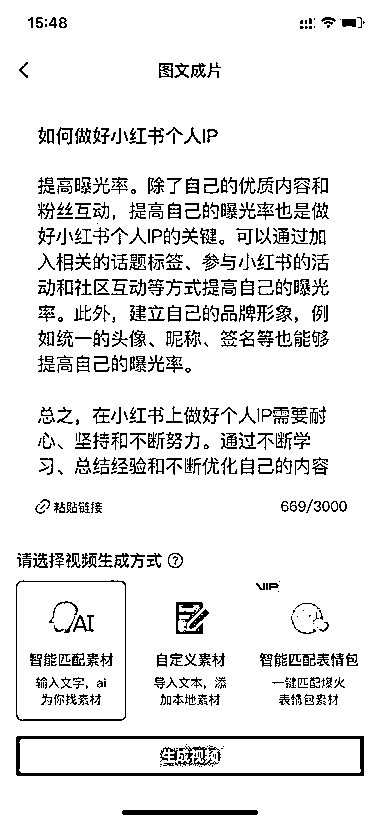
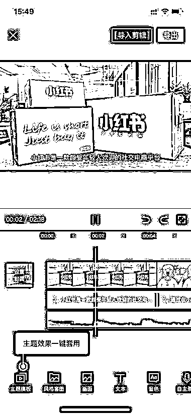

# ChatGPT+剪映，发百家号或其他自媒体平台变现

> 原文：[`www.yuque.com/for_lazy/xkrm14/tz740008xd5bs2yd`](https://www.yuque.com/for_lazy/xkrm14/tz740008xd5bs2yd)

<ne-p id="u8c3f4461" data-lake-id="u8c3f4461"><ne-text id="u3da8e0ad">作者： 雪球</ne-text></ne-p> <ne-p id="u72d144e3" data-lake-id="u72d144e3"><ne-text id="u15a737a5">日期：2023-02-15</ne-text></ne-p> <ne-p id="u028ddf9a" data-lake-id="u028ddf9a"><ne-text id="u995f7805">点赞数：</ne-text><ne-text id="u82c0c496" ne-bold="true">27</ne-text></ne-p> <ne-hole id="ua301e399" data-lake-id="ua301e399"><ne-card data-card-name="hr" data-card-type="block" id="euCa5" data-event-boundary="card"><ne-p id="u545552bc" data-lake-id="u545552bc"><ne-text id="u1760f1d5">正文：</ne-text></ne-p> <ne-p id="ua814ec95" data-lake-id="ua814ec95"><ne-text id="ud955eb5e">ChatGPT+剪映+百家号等 1、用 ChatGPT 生成文本内容。 2、剪映图文成片，生成视频。 2、发百家号或其他自媒体平台变现。</ne-text> <ne-text id="u8c53fe8a">动手制作了一段视频，花了总计约 10 分钟，包括中途等待 ChatGPT 回答的时间，以及视频导出的时间。</ne-text> <ne-text id="uc32f5ea4">制作效率还是蛮高的，如果对某一领域比较熟悉，问的问题好，回答的内容质量也会更好，不过 ChatGPT 需要“调教”。</ne-text></ne-p> <ne-p id="u9e9daa29" data-lake-id="u9e9daa29"><ne-card data-card-name="image" data-card-type="inline" id="Yjdds" data-event-boundary="card"></ne-card></ne-p> <ne-p id="u0f7cd049" data-lake-id="u0f7cd049"><ne-card data-card-name="image" data-card-type="inline" id="dm9Un" data-event-boundary="card"></ne-card></ne-p> <ne-p id="uc173463b" data-lake-id="uc173463b"><ne-card data-card-name="image" data-card-type="inline" id="flTNK" data-event-boundary="card"></ne-card></ne-p> <ne-p id="u163b2f4e" data-lake-id="u163b2f4e"><ne-card data-card-name="image" data-card-type="inline" id="OTIlj" data-event-boundary="card"></ne-card></ne-p> <ne-hole id="ued143537" data-lake-id="ued143537"><ne-card data-card-name="hr" data-card-type="block" id="Ox97B" data-event-boundary="card"><ne-p id="u649496b5" data-lake-id="u649496b5"><ne-text id="ue400c6e6">评论区：</ne-text></ne-p> <ne-p id="ue0204914" data-lake-id="ue0204914"><ne-text id="u4b8d0eb3">百易 : 批量化开卷了</ne-text></ne-p> <ne-p id="ua281aa5c" data-lake-id="ua281aa5c"><ne-text id="uafc7fc42">林哲 : 这个好</ne-text></ne-p> <ne-hole id="u3f1b1302" data-lake-id="u3f1b1302"><ne-card data-card-name="hr" data-card-type="block" id="Wby8P" data-event-boundary="card"><ne-p id="u29c2aa04" data-lake-id="u29c2aa04"><ne-text id="u61ad182c">公众号懒人找资源，懒人专属群分享</ne-text></ne-p></ne-card></ne-hole></ne-card></ne-hole></ne-card></ne-hole>