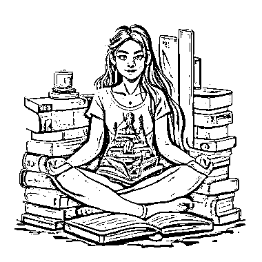

# AI 整合，ChatGPT + Midjourney 生成小红书图文应用

> 原文：[`www.yuque.com/for_lazy/xkrm14/ta8c7grqlbggdolb`](https://www.yuque.com/for_lazy/xkrm14/ta8c7grqlbggdolb)

作者： 姬小光

日期：2023-02-13

点赞数：77

正文：

AI 整合，ChatGPT + Midjourney 生成小红书图文例子： 首先，选好问题，丢给 ChatGPT，如：你是一个心理咨询师，关于女性成长你有什么建议？以小红书的形式展示，简单且吸引眼球的标题，每个段落都加一个 emoji，最后加一些 tag，请用这种风格写 200 字以内的文章。 得到文案： 👩‍🦱”女性成长的 7 个关键点”💡 1️⃣ 认识自己: 了解自己的优点和不足，找到自己的价值观和目标。👩‍🦰 2️⃣ 建立自信: 相信自己的能力，勇敢面对挑战。👩‍🦲 3️⃣ 发现兴趣: 找到自己真正喜欢的事物，享受生活。👩‍🦳 4️⃣ 发展社交技能: 学会与他人交往，建立良好的人际关系。👩‍🦲 5️⃣ 健康生活: 保持身体和心理健康，生活平衡。👩‍🦱 6️⃣ 接受失败: 学会从失败中吸取教训，不断进步。👩‍🦳 7️⃣ 坚持自我: 始终坚守对自己的承诺，保持自己的风格。👩‍🦲 #女性成长 #自信 #认识自己 #健康生活 #社交技能 #失败教训 #坚持自我 然后在去 Midjourney 生成主题图，例如： A slender girl with high hips, an athlete, shoulder-length hair, a thin nose, smart beautiful eyes, strong- willed facial features, a smile, yoga, in a lotus position, in a topic, in shorts, against the background of books, there is a press, beautiful shoulders, a long neck and beautiful collarbones, beautiful legs, in full growth 几秒钟后得到图片，选你喜欢的，加上文案发到小红书，一篇中等质量笔记完成。

评论区：

秋生 : 这里面的资源可以提供吗

姬小光 : 这两个账号星球里都有很多做的，可以搜一下

秋生 : 底下的英文是怎么生成的

姬小光 : 我随便找了个例子，可以自己写，也可以让 ChatGPT 生成

公众号懒人找资源，懒人专属群分享

