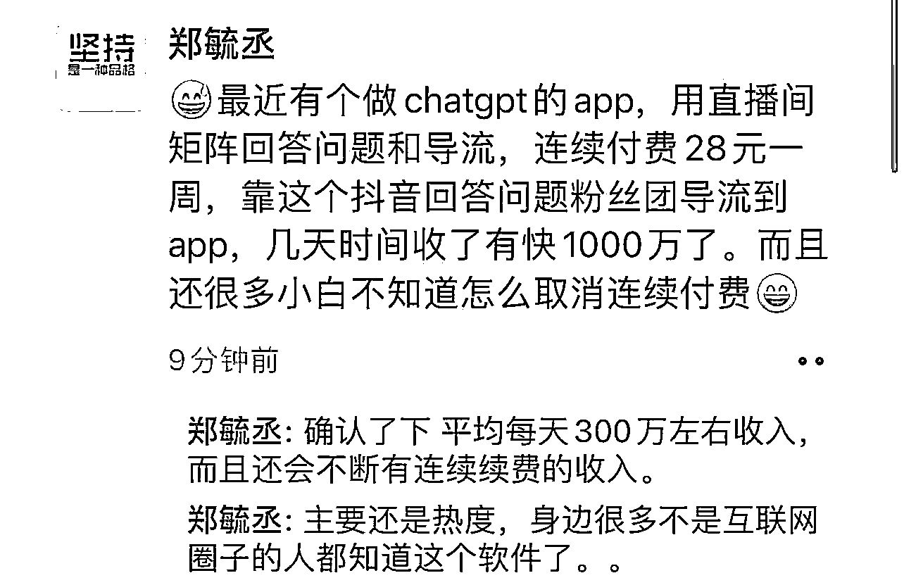

# App Store 上的与 ChatGPT 相关的国产 APP

> 原文：[`www.yuque.com/for_lazy/xkrm14/ercf0xsb8gcbex74`](https://www.yuque.com/for_lazy/xkrm14/ercf0xsb8gcbex74)

作者： 根叔

日期：2023-02-15

点赞数：13

<ne-card data-card-name="hr" data-card-type="block" id="UHkfP" data-event-boundary="card">

正文：

接 大大的风向标（），App Store 上的与 ChatGPT 相关的 APP，开发者通过开直播的方式来引流进行下载和开通 VIP，狠赚了一波，这种思路可以借鉴！[https://t.zsxq.com/0b8LXOqOG](https://t.zsxq.com/0b8LXOqOG)

<ne-card data-card-name="image" data-card-type="inline" id="sHDI1" data-event-boundary="card">  <ne-p id="ub8b5baff" data-lake-id="ub8b5baff"><ne-card data-card-name="image" data-card-type="inline" id="WV2wY" data-event-boundary="card">  <ne-p id="u53e06351" data-lake-id="u53e06351"><ne-card data-card-name="image" data-card-type="inline" id="KnNLZ" data-event-boundary="card">  <ne-card data-card-name="hr" data-card-type="block" id="b3aAl" data-event-boundary="card"><ne-p id="u04c3dcf6" data-lake-id="u04c3dcf6">评论区：

暂无评论

<ne-card data-card-name="hr" data-card-type="block" id="QTl0D" data-event-boundary="card">

公众号懒人找资源，懒人专属群分享

</ne-card></ne-card></ne-card></ne-p></ne-card></ne-p></ne-card></ne-p></ne-card>