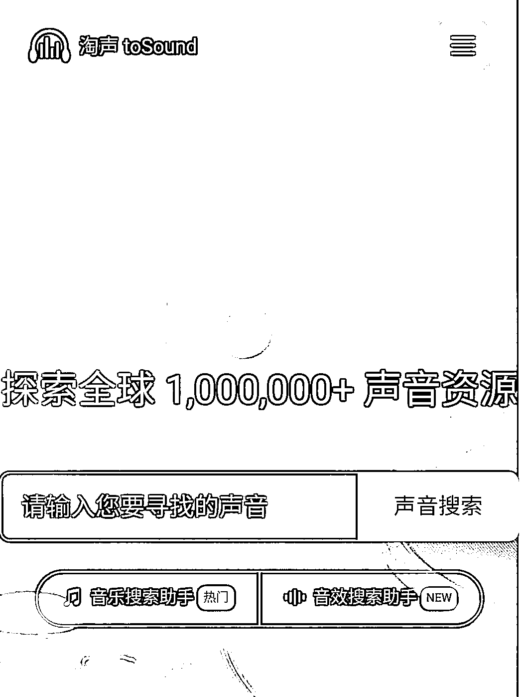

# 淘声网含百万加声音和音效资源，可以给视频配音

> 原文：[`www.yuque.com/for_lazy/xkrm14/klgkmyu9is76wivo`](https://www.yuque.com/for_lazy/xkrm14/klgkmyu9is76wivo)

作者： 大池

日期：2023-02-17

点赞数：94

<ne-hole id="u21be5975" data-lake-id="u21be5975"><ne-card data-card-name="hr" data-card-type="block" id="WXmki" data-event-boundary="card">

正文：

淘声网 该网站含百万加声音和音效资源，给视频配音和加音效，就来这里!(可配合 IDM 使用下载) [淘声网+-+toSound 声音搜索引擎+-+免费音效素材资源|视频游戏配乐下载](https://www.tosound.com)

<ne-card data-card-name="image" data-card-type="inline" id="UDWUH" data-event-boundary="card"></ne-card>

<ne-hole id="ubf55ca62" data-lake-id="ubf55ca62"><ne-card data-card-name="hr" data-card-type="block" id="RkkKv" data-event-boundary="card">

评论区：

Alex Li : 是把 freesound 的全部汉化了？

波叔 : 这个好呀，感谢分享

一起挣钱~三亚 : 这个能下视频的背景音乐不

<ne-hole id="ub2692ec6" data-lake-id="ub2692ec6"><ne-card data-card-name="hr" data-card-type="block" id="Gsxxz" data-event-boundary="card">

公众号懒人找资源，懒人专属群分享

</ne-card></ne-hole></ne-card></ne-hole></ne-card></ne-hole>