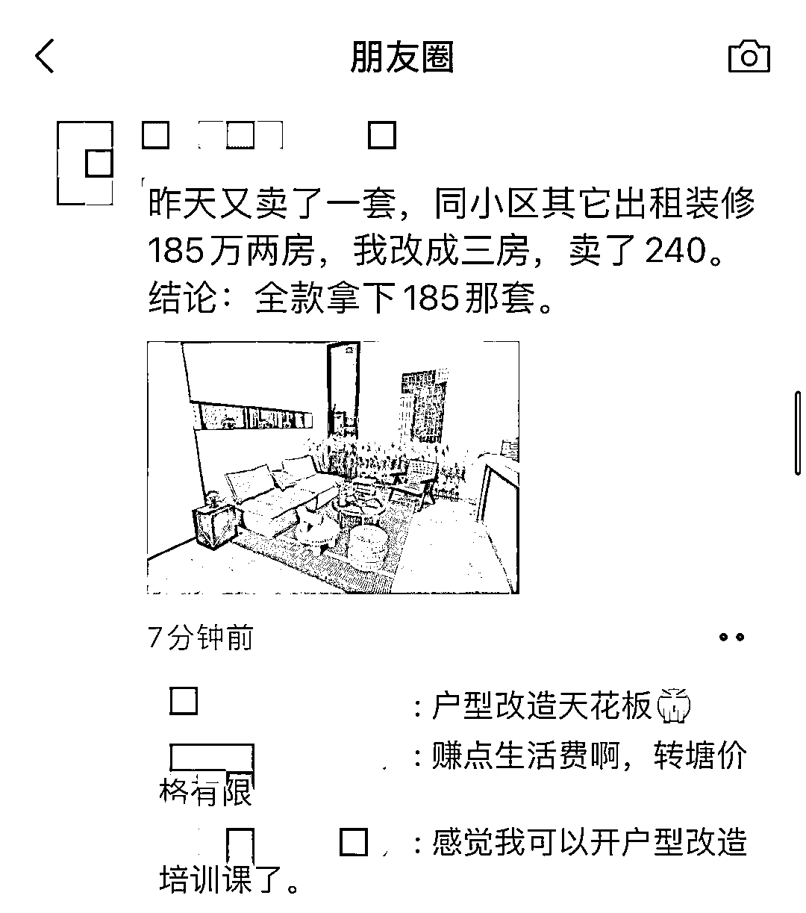

# 通过二手房改造，较大提升房屋最终出手价

> 原文：[`www.yuque.com/for_lazy/xkrm14/ter1hcnqd6vfqk6q`](https://www.yuque.com/for_lazy/xkrm14/ter1hcnqd6vfqk6q)

作者： 灵军

日期：2023-02-16

点赞数：14

<ne-hole id="ua86dbefa" data-lake-id="ua86dbefa"><ne-card data-card-name="hr" data-card-type="block" id="VO5VF" data-event-boundary="card">

正文：

通过帮即将出手的二手房改造，改造户型和装修，从而较大提升房屋最终出手价。 收费模式目前是户型改造，装修代卖，或者装修整包。

<ne-card data-card-name="image" data-card-type="inline" id="DQ3Ir" data-event-boundary="card">  <ne-hole id="uff80d302" data-lake-id="uff80d302"><ne-card data-card-name="hr" data-card-type="block" id="sfZeC" data-event-boundary="card"><ne-p id="u992b4582" data-lake-id="u992b4582">评论区：

金琳 : 串串就经常这样低价收旧房，改造后卖高价，但是这种房子的装修因为成本低，一般后期维护问题大。

灵军 : 的确，有这个风险，一般就图前期好看，不太实用

犇牛 : 房虫也干这个

米笠 : 这个有个专有名词，叫 凤变冰

<ne-hole id="u02422823" data-lake-id="u02422823"><ne-card data-card-name="hr" data-card-type="block" id="t1DiP" data-event-boundary="card">

公众号懒人找资源，懒人专属群分享

</ne-card></ne-hole></ne-card></ne-hole></ne-card></ne-p></ne-card></ne-hole>