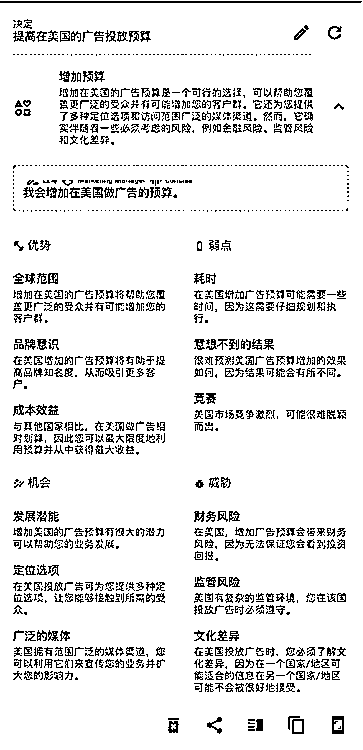

# 「Rationale」是具有批判性思维的 AI 辅助决策工具

> 原文：[`www.yuque.com/for_lazy/xkrm14/efh7v5xydcz4mfuk`](https://www.yuque.com/for_lazy/xkrm14/efh7v5xydcz4mfuk)

作者： 雪球

日期：2023-02-13

点赞数：17

正文：

让 ChatGPT 落地转化为决策生产力的「Rationale」 一句简介 「Rationale」是一款具有批判性思维的 AI 辅助决策工具，它能够自动分析用户决策，帮助用户拓宽思路、提炼观点从而做出更加理性的决策。 应用简介 决策并不是一件轻松容易的事情。相信大家都遇到过进退两难的事情，最终不得不抛硬币来决定。在日常生活和工作中，决策无处不在，我们常常需要在复杂的条件中快速做出最优决策。所谓“最优决定”，就是不仅要兼顾效率、可行性，更要对对可能产生的风险进行预估。「Rationale」就是一款能够帮助你做出最优决定的的生产力工具。只需要输入你的决定，Rationale 便可以快速分析出该决定的优劣，机会，后果等诸多因素。它利用了最新的 ChatGPT 技术于上下文学习技术，帮助你更理性的做出最优选择。 Rationale 不仅使用于个人用户，也同样适用于咨询、评测、调研、策划、汇报等专业场景。[Rationale+-+a+revolutionary+decision- making+AI+pow...](https://rationale.jina.ai/)

  

  

  

  

评论区：

冬日暖阳 : 手机端怎么下载的

公众号懒人找资源，懒人专属群分享

</ne-p></ne-p></ne-p></ne-p>