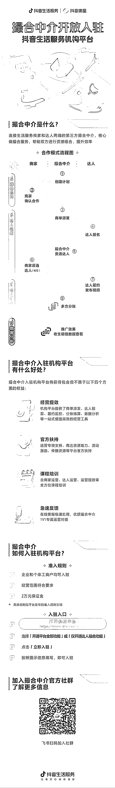

# 抖音本地生活新招募，达人撮合业务

> 原文：[`www.yuque.com/for_lazy/xkrm14/ce0er2y7cevk0ofu`](https://www.yuque.com/for_lazy/xkrm14/ce0er2y7cevk0ofu)

<ne-p id="u02668348" data-lake-id="u02668348"><ne-text id="u649ef08c">作者： 怡成</ne-text></ne-p> <ne-p id="ub18542a4" data-lake-id="ub18542a4"><ne-text id="uc0b5ebf7">日期：2023-02-13</ne-text></ne-p> <ne-p id="ub647cbb4" data-lake-id="ub647cbb4"><ne-text id="u388da3cc">点赞数：</ne-text><ne-text id="uaf3ee336" ne-bold="true">20</ne-text></ne-p> <ne-hole id="ue9001a64" data-lake-id="ue9001a64"><ne-card data-card-name="hr" data-card-type="block" id="jEMbC" data-event-boundary="card"><ne-p id="u38aa0d76" data-lake-id="u38aa0d76"><ne-text id="u54df88e4">正文：</ne-text></ne-p> <ne-p id="ud4e20431" data-lake-id="ud4e20431"><ne-text id="u9d3f9d43">本地生活新招募，达人撮合业务，可以玩 1、矩阵号给商家发视频，有了分账系统 2、收徒，培训又可以玩一波</ne-text></ne-p> <ne-p id="u4124064d" data-lake-id="u4124064d"><ne-card data-card-name="image" data-card-type="inline" id="aovBU" data-event-boundary="card"></ne-card></ne-p> <ne-hole id="ueda1cc2b" data-lake-id="ueda1cc2b"><ne-card data-card-name="hr" data-card-type="block" id="wzMUn" data-event-boundary="card"><ne-p id="u4b1450a0" data-lake-id="u4b1450a0"><ne-text id="ue436be79">评论区：</ne-text></ne-p> <ne-p id="ueab27a43" data-lake-id="ueab27a43"><ne-text id="uc169a53d">怡成 : O(∩_∩)O 谢谢</ne-text></ne-p> <ne-p id="u9cab706f" data-lake-id="u9cab706f"><ne-text id="ufc34237d">小金叔叔 : 类似现在 MCN 的玩法？</ne-text></ne-p> <ne-p id="u093c9468" data-lake-id="u093c9468"><ne-text id="u5a0c0510">怡成 : 差不多，就是一个中介撮合</ne-text></ne-p> <ne-hole id="ub5a59366" data-lake-id="ub5a59366"><ne-card data-card-name="hr" data-card-type="block" id="OlAYj" data-event-boundary="card"><ne-p id="uabbc726b" data-lake-id="uabbc726b"><ne-text id="u58832342">公众号懒人找资源，懒人专属群分享</ne-text></ne-p></ne-card></ne-hole></ne-card></ne-hole></ne-card></ne-hole>