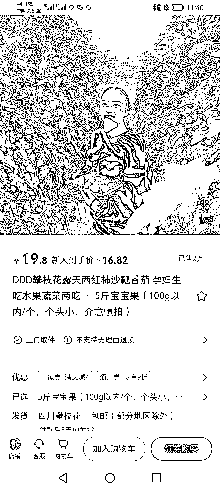

# 小红书推广原产地水果

> 原文：[`www.yuque.com/for_lazy/xkrm14/ykv2cdwg0dfu1e1o`](https://www.yuque.com/for_lazy/xkrm14/ykv2cdwg0dfu1e1o)

作者： 留住昨天

日期：2023-02-16

点赞数：18

<ne-hole id="u64f25e86" data-lake-id="u64f25e86"><ne-card data-card-name="hr" data-card-type="block" id="qOott" data-event-boundary="card">

正文：

有水果资源的也可以挂小红书试试。坚持一下去就会有收获。

<ne-card data-card-name="image" data-card-type="inline" id="MPiWj" data-event-boundary="card">  <ne-p id="uc4129f4e" data-lake-id="uc4129f4e"><ne-card data-card-name="image" data-card-type="inline" id="Obn1h" data-event-boundary="card">  <ne-hole id="u8af5f0d0" data-lake-id="u8af5f0d0"><ne-card data-card-name="hr" data-card-type="block" id="QDuJH" data-event-boundary="card"><ne-p id="u481caa4a" data-lake-id="u481caa4a">评论区：

肖翔 : 两万单 这个成绩很牛啊

留住昨天 : 是呀。有水果资源的可以挂一下试试。无脑上视频就好啦[呲牙]

洞主 : 可否留个 V 交流一下

留住昨天 : 这个是我看到的，不是我的项目😂，我就发个风向标

<ne-hole id="u201dae1c" data-lake-id="u201dae1c"><ne-card data-card-name="hr" data-card-type="block" id="Dk1MD" data-event-boundary="card">

公众号懒人找资源，懒人专属群分享

</ne-card></ne-hole></ne-card></ne-hole></ne-card></ne-p></ne-card></ne-p></ne-card></ne-hole>