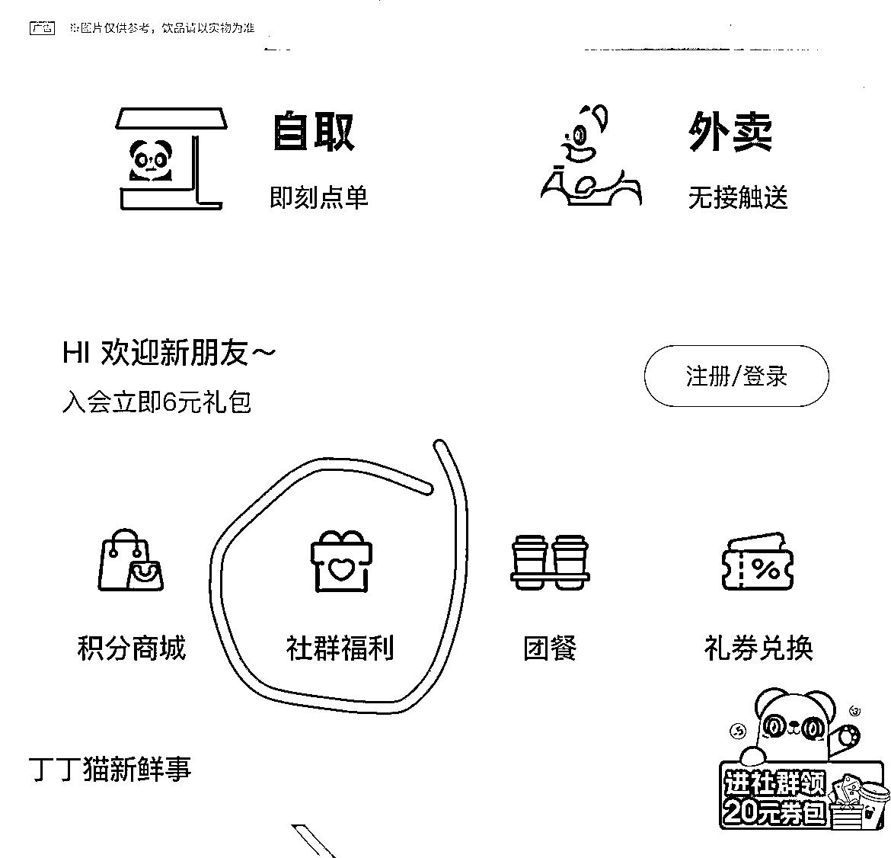

# 一个免费薅同城群的方法

> 原文：[`www.yuque.com/for_lazy/xkrm14/ogs2treo2srz70ee`](https://www.yuque.com/for_lazy/xkrm14/ogs2treo2srz70ee)

作者： 小明同学

日期：2023-02-16

点赞数：28

<ne-hole id="u4101b12a" data-lake-id="u4101b12a"><ne-card data-card-name="hr" data-card-type="block" id="RKcoz" data-event-boundary="card">

正文：

又发现了一个免费薅同城群的方法，类似之前美团、滴滴同城群方法 打开茶百道小程序—社群福利- 进去后会自动是最近的茶百道福利群，点击切换地址，就可以切换 n 个同城群。

<ne-card data-card-name="image" data-card-type="inline" id="h8Wf8" data-event-boundary="card">  <ne-p id="u15be037b" data-lake-id="u15be037b"><ne-card data-card-name="image" data-card-type="inline" id="OBveO" data-event-boundary="card">  <ne-hole id="uae276f21" data-lake-id="uae276f21"><ne-card data-card-name="hr" data-card-type="block" id="tCWjC" data-event-boundary="card"><ne-p id="u76f34793" data-lake-id="u76f34793">评论区：

<ne-hole id="u4187d77d" data-lake-id="u4187d77d"><ne-card data-card-name="hr" data-card-type="block" id="qX1ZA" data-event-boundary="card">

公众号懒人找资源，懒人专属群分享

</ne-card></ne-hole></ne-card></ne-hole></ne-card></ne-p></ne-card></ne-p></ne-card></ne-hole>