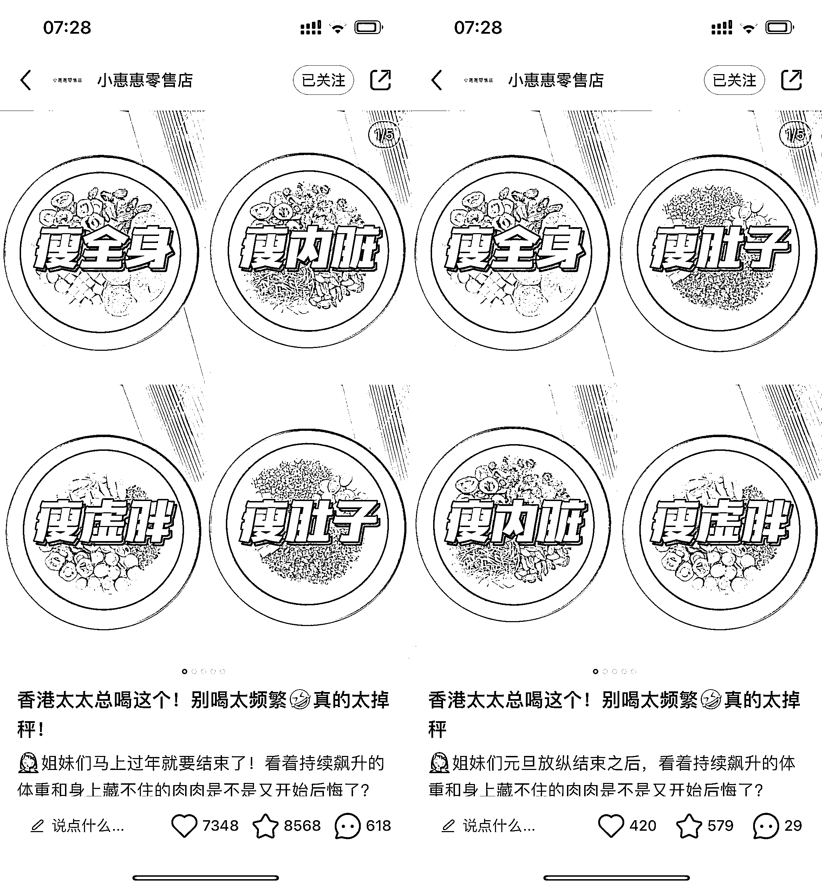

# 小红书重复发爆款内容，仍然有流量

> 原文：[`www.yuque.com/for_lazy/xkrm14/ruypu29egm6vn3yv`](https://www.yuque.com/for_lazy/xkrm14/ruypu29egm6vn3yv)

作者： 马克图布

日期：2023-02-16

点赞数：34

<ne-hole id="u5a43d846" data-lake-id="u5a43d846"><ne-card data-card-name="hr" data-card-type="block" id="fZexv" data-event-boundary="card">

正文：

醒太早，再来分享一下小红书吃干抹净打法[微笑] 大家看图一，这是我发现的一个养生类的账号啊。[闭嘴] 他的玩法就是说，我找到一个爆款之后啊，我来回的发，基本上每天都发这个爆款，甚至内容啊，文案图片全部不做改动。 然后你会发现他，他有的时候火，有的时候不火，但是这就是他的爆款模板，他不停的发重复的，一直把这个模板给发的没有流量了。 然后他再换一个图片，有继续这个模板，然后他就是在这个模板的基础上，不断的创造新的流量。[色][色] 然后我们普通人怎么做的啊，比如说图四，图四就是另一个博主，他就直接做了矩阵，当他发现了这个模式的时候，她自己也直接搞了四个账号，可能有更多的账号，我没有发现。因为她名字都带晴啊，IP 都是在山东，大家懂的。 其实大家自己去研究也会发现，这个养生类目的话，按照这个套路去玩的，其实是可行的，小红书是一个有趣的赛道，玩法很多。大家仔细去观察，每天都会有不同收获[呲牙]

<ne-card data-card-name="image" data-card-type="inline" id="PfH3g" data-event-boundary="card"></ne-card>

<ne-card data-card-name="image" data-card-type="inline" id="bDnq3" data-event-boundary="card"></ne-card>

<ne-card data-card-name="image" data-card-type="inline" id="XLbOm" data-event-boundary="card"></ne-card>

<ne-card data-card-name="image" data-card-type="inline" id="nKWjt" data-event-boundary="card"></ne-card>

<ne-hole id="u45550764" data-lake-id="u45550764"><ne-card data-card-name="hr" data-card-type="block" id="rH1aM" data-event-boundary="card">

评论区：

大星儿 : 爆款的逻辑是重复[捂脸]

<ne-hole id="u69a2f53e" data-lake-id="u69a2f53e"><ne-card data-card-name="hr" data-card-type="block" id="QvuHV" data-event-boundary="card">

公众号懒人找资源，懒人专属群分享

</ne-card></ne-hole></ne-card></ne-hole></ne-card></ne-hole>