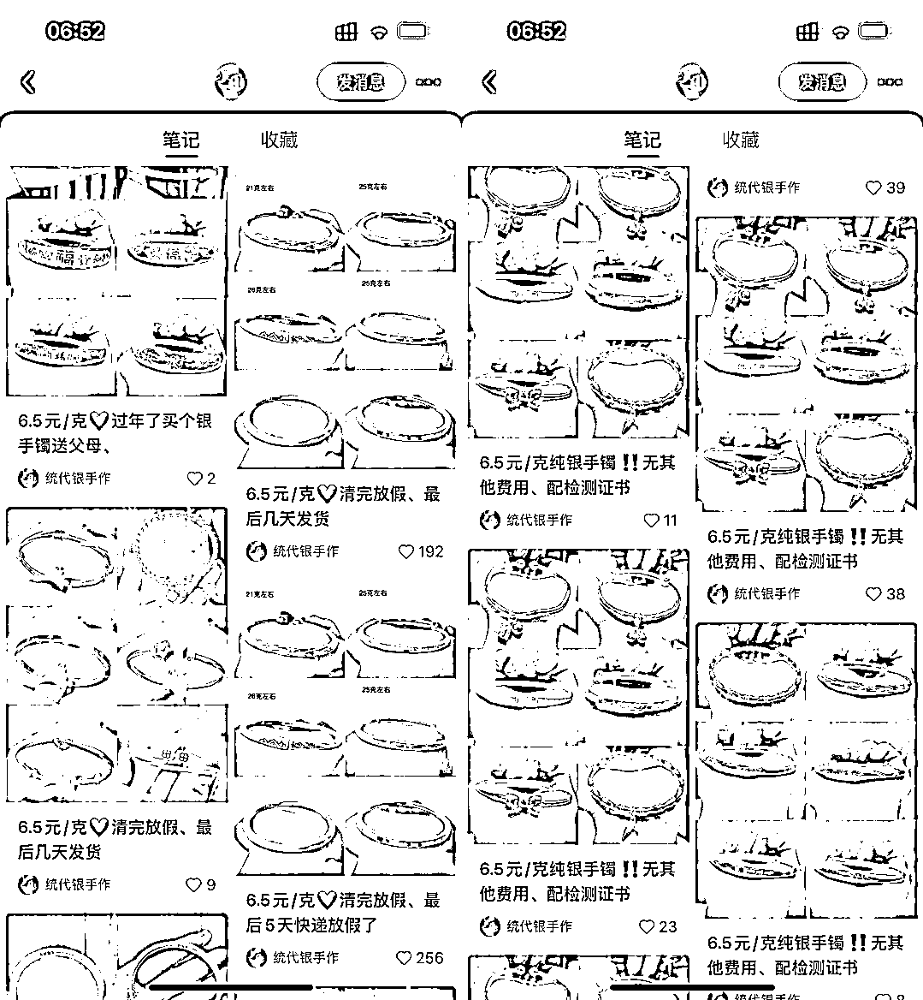

# 小红书使用爆款模板，持续获得流量

> 原文：[`www.yuque.com/for_lazy/xkrm14/np3rgh9d2d4qypra`](https://www.yuque.com/for_lazy/xkrm14/np3rgh9d2d4qypra)

作者： 马克图布

日期：2023-02-16

点赞数：17

<ne-hole id="ub89af4d4" data-lake-id="ub89af4d4"><ne-card data-card-name="hr" data-card-type="block" id="gQXiQ" data-event-boundary="card">

正文：

做小红书其实就是需要找到一套适合自己类目的打法。理解为找模板！ 一旦找到了这一套打法，你的流量就会源源不断，比如说截图中的这一个账号啊，他就通过这个多产品的模板，加上 6.5 元/克，击中用户敏感点。不停的获取流量。 其实我在面试中也遇到有人讲到他自己玩小红书的打法，找到本命的爆款后，他按照这个套路继续做，换品，模板不换。 然后他就以为自己做小红书很牛逼，可以教别人了[呲牙]

<ne-card data-card-name="image" data-card-type="inline" id="aaI7Q" data-event-boundary="card">  <ne-p id="ua8ffc00b" data-lake-id="ua8ffc00b"><ne-card data-card-name="image" data-card-type="inline" id="DUDpO" data-event-boundary="card">  <ne-hole id="ue0547a28" data-lake-id="ue0547a28"><ne-card data-card-name="hr" data-card-type="block" id="U7JaZ" data-event-boundary="card"><ne-p id="ue5054456" data-lake-id="ue5054456">评论区：

暂无评论

<ne-hole id="u665707df" data-lake-id="u665707df"><ne-card data-card-name="hr" data-card-type="block" id="Vogbj" data-event-boundary="card">

公众号懒人找资源，懒人专属群分享

</ne-card></ne-hole></ne-card></ne-hole></ne-card></ne-p></ne-card></ne-p></ne-card></ne-hole>