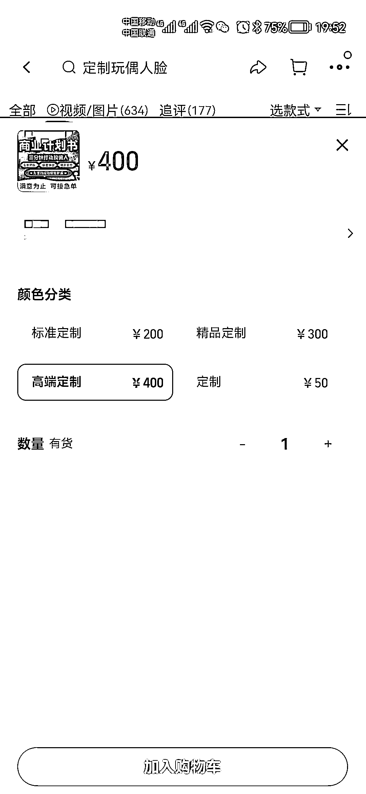

# 淘宝售卖商业计划书

> 原文：[`www.yuque.com/for_lazy/xkrm14/ebgrc7rhl3x3ylgr`](https://www.yuque.com/for_lazy/xkrm14/ebgrc7rhl3x3ylgr)

作者： Leeka

日期：2023-02-15

点赞数：10

<ne-hole id="uecb2f08a" data-lake-id="uecb2f08a">

正文：

淘宝，商业计划书售卖 订金 400，全款 2000 通常拍单的都是小白[偷笑]

  <ne-p id="u5c268a9c" data-lake-id="u5c268a9c">  <ne-hole id="u4c1435ee" data-lake-id="u4c1435ee"><ne-p id="ud7f349fe" data-lake-id="ud7f349fe">评论区：

进击的王百万 : 商业计划书怎么写？ GPT 工具吗

Leeka : 方法多了去了，互联网一捞一大把。

<ne-hole id="ud97b4e6c" data-lake-id="ud97b4e6c">

公众号懒人找资源，懒人专属群分享

</ne-hole></ne-hole></ne-p></ne-p></ne-hole>