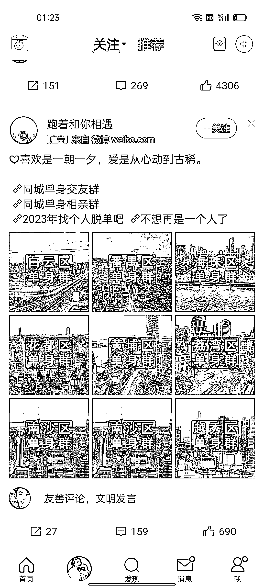

# 微博投放相亲广告

> 原文：[`www.yuque.com/for_lazy/xkrm14/oigrkc19qavw0imo`](https://www.yuque.com/for_lazy/xkrm14/oigrkc19qavw0imo)

<ne-p id="u19ec1477" data-lake-id="u19ec1477"><ne-text id="u156a1ce9">作者： 明月几时有</ne-text></ne-p> <ne-p id="u4e608919" data-lake-id="u4e608919"><ne-text id="u7116db00">日期：2023-02-15</ne-text></ne-p> <ne-p id="u7c898ec7" data-lake-id="u7c898ec7"><ne-text id="u3c788bc6">点赞数：</ne-text><ne-text id="ud2703e21" ne-bold="true">9</ne-text></ne-p> <ne-hole id="uc5850f20" data-lake-id="uc5850f20"><ne-card data-card-name="hr" data-card-type="block" id="NlVlN" data-event-boundary="card"><ne-p id="ucd0ba481" data-lake-id="ucd0ba481"><ne-text id="u65674f58">正文：</ne-text></ne-p> <ne-p id="u373d015a" data-lake-id="u373d015a"><ne-text id="u7d552645">微博投放的相亲广告，图片排列方式，对单身的人来说有很大的吸引力</ne-text></ne-p> <ne-p id="u91293a98" data-lake-id="u91293a98"><ne-card data-card-name="image" data-card-type="inline" id="SYfNx" data-event-boundary="card"></ne-card></ne-p> <ne-hole id="u448ce941" data-lake-id="u448ce941"><ne-card data-card-name="hr" data-card-type="block" id="EaeqH" data-event-boundary="card"><ne-p id="u1fb8d364" data-lake-id="u1fb8d364"><ne-text id="ue7823059">评论区：</ne-text></ne-p> <ne-p id="u4617d7c0" data-lake-id="u4617d7c0"><ne-text id="u232357d3">暂无评论</ne-text></ne-p> <ne-hole id="ub5ae1468" data-lake-id="ub5ae1468"><ne-card data-card-name="hr" data-card-type="block" id="GW4iQ" data-event-boundary="card"><ne-p id="u9dfab622" data-lake-id="u9dfab622"><ne-text id="ua6d71a89">公众号懒人找资源，懒人专属群分享</ne-text></ne-p></ne-card></ne-hole></ne-card></ne-hole></ne-card></ne-hole>