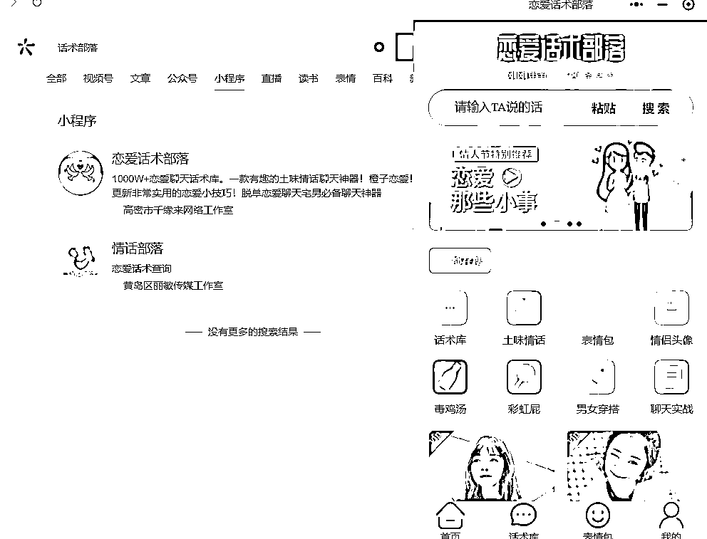
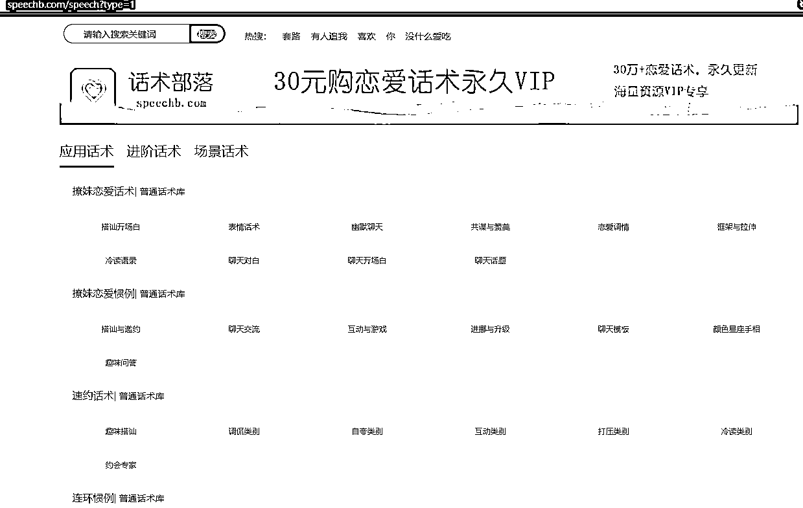

# 细分门类的内容领域，恋爱话术部落

> 原文：[`www.yuque.com/for_lazy/xkrm14/peaolb3gypeyk0qv`](https://www.yuque.com/for_lazy/xkrm14/peaolb3gypeyk0qv)

作者： 财火

日期：2023-02-14

点赞数：14

<ne-hole id="u4aa71f53" data-lake-id="u4aa71f53"><ne-card data-card-name="hr" data-card-type="block" id="ZAMBX" data-event-boundary="card">

正文：

今天情人节，发现一个很小门类的小程序——“恋爱话术部落”，从热度看，访问量还不小，而且都是付费的，堪称“刚需”。它还做了一个网站： 参考这个思路，其实如果找到一个很细分门类的内容领域，整理内容集合做成一个小程序，设置好关键词，应该也是很有搞头的。[恋爱话术库](https://www.speechb.com/speech)

<ne-card data-card-name="image" data-card-type="inline" id="NqKRF" data-event-boundary="card">  <ne-p id="u18f4700f" data-lake-id="u18f4700f"><ne-card data-card-name="image" data-card-type="inline" id="PJPag" data-event-boundary="card">  <ne-hole id="u06b1ae72" data-lake-id="u06b1ae72"><ne-card data-card-name="hr" data-card-type="block" id="Jwuvp" data-event-boundary="card"><ne-p id="u7fe02ce7" data-lake-id="u7fe02ce7">评论区：

暂无评论

<ne-hole id="u1d1d9888" data-lake-id="u1d1d9888"><ne-card data-card-name="hr" data-card-type="block" id="Hl3hN" data-event-boundary="card">

公众号懒人找资源，懒人专属群分享

</ne-card></ne-hole></ne-card></ne-hole></ne-card></ne-p></ne-card></ne-p></ne-card></ne-hole>