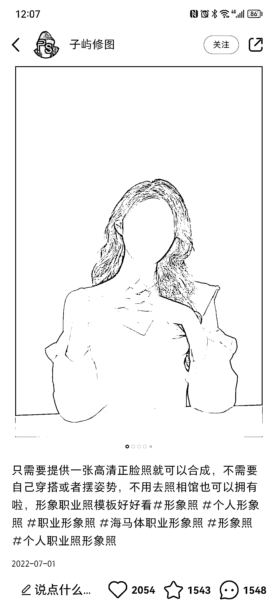
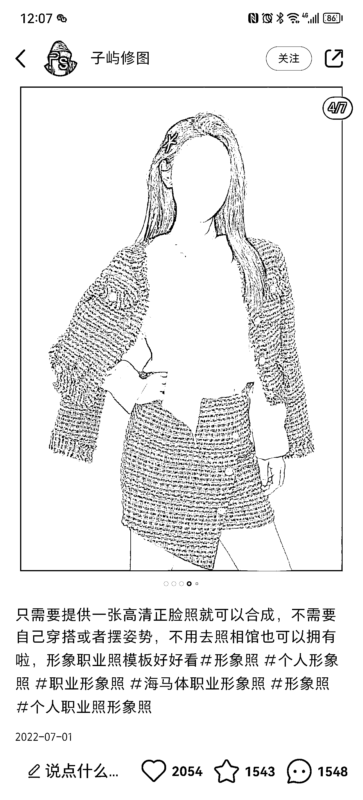

# 小红书里面帮人 p 形象照

> 原文：[`www.yuque.com/for_lazy/xkrm14/gkn1bwf3pt1y9ggg`](https://www.yuque.com/for_lazy/xkrm14/gkn1bwf3pt1y9ggg)

作者： 蓝子鱼

日期：2023-02-14

点赞数：18

<ne-hole id="uced56170" data-lake-id="uced56170">

正文：

刷到小红书里面帮人 p 形象照的，只要提高正面照就可以做，这个对好多人来讲是刚需，拍一次至少要大几百，而且还没那些模特好看，还要花时间特地去拍。 这个应该可以跟一些 ai 软件进行结合，那就没什么成本，只需要在互联网就行获客就可以，一张价格还不低，也可以做套餐卖。

<ne-hole id="u8e3d6757" data-lake-id="u8e3d6757">

评论区：

一堆薄码 : 标记一下，朋友搞得 AI 工具有这个功能，可以用来引流

<ne-hole id="u730a0128" data-lake-id="u730a0128">

公众号懒人找资源，懒人专属群分享

</ne-hole></ne-hole></ne-hole>