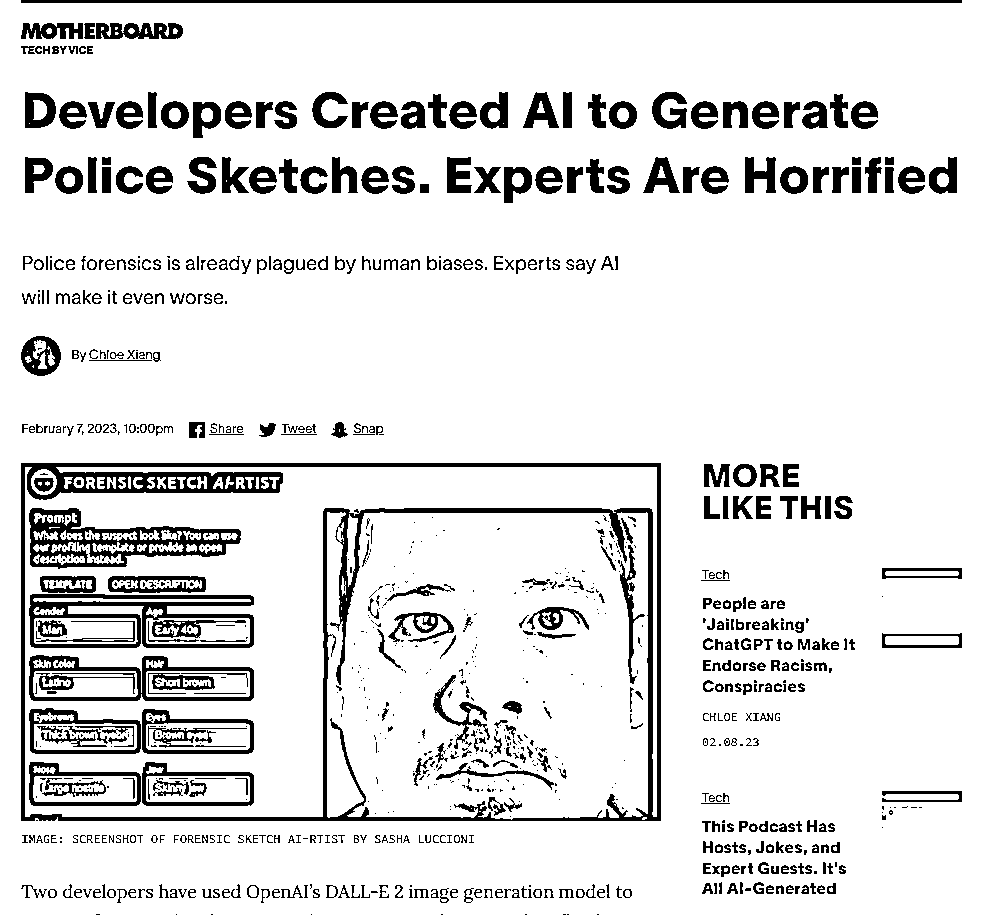

# AI 辅助制作嫌疑人照片

> 原文：[`www.yuque.com/for_lazy/xkrm14/bxuntb7tc8by1cnf`](https://www.yuque.com/for_lazy/xkrm14/bxuntb7tc8by1cnf)

作者： 橙 Sir

日期：2023-02-17

点赞数：22

<ne-hole id="u5e816a82" data-lake-id="u5e816a82">

正文：

AI 辅助制作嫌疑人照片，有做公安业务的朋友可以关注一下 1、根据嫌疑人的描述词：肤色，眉毛，鼻子，年龄，头发，眼睛等，利用 ChatGPT 生成描述； 2、使用 DAALL-E2 生成逼真的肖像图[https://www.vice.com/en/article/qjk745/ai-police-s...](https://www.vice.com/en/article/qjk745/ai-police-sketches)

  <ne-hole id="u138543ce" data-lake-id="u138543ce"><ne-p id="u9e4483d2" data-lake-id="u9e4483d2">评论区：

<ne-hole id="uf3298826" data-lake-id="uf3298826">

公众号懒人找资源，懒人专属群分享

</ne-hole></ne-hole></ne-p></ne-hole>