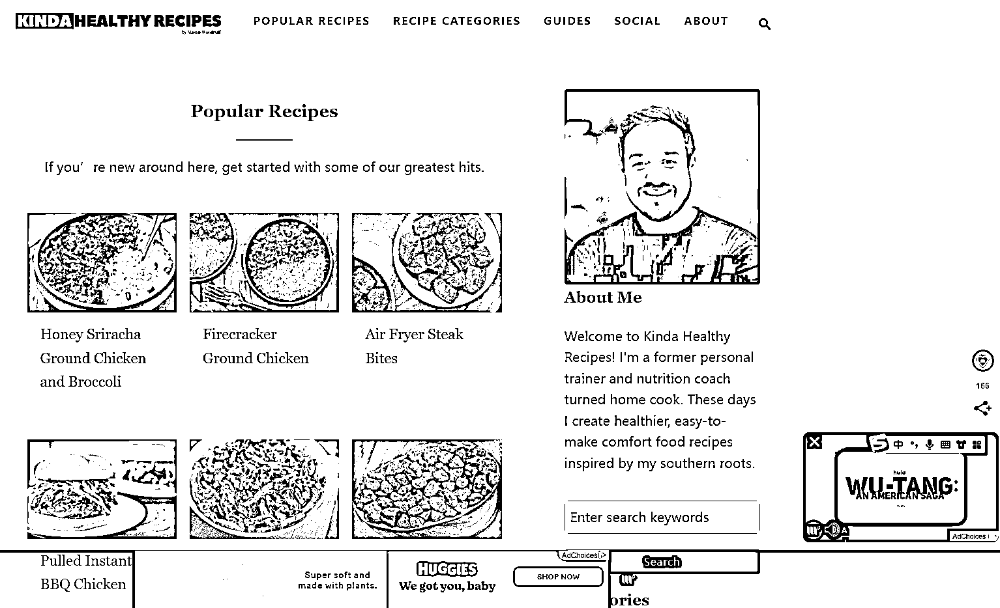

# 英文网站通过订阅和广告盈利

> 原文：[`www.yuque.com/for_lazy/xkrm14/wbxa41lkhkgq81yn`](https://www.yuque.com/for_lazy/xkrm14/wbxa41lkhkgq81yn)

作者： 米笠

日期：2023-02-15

点赞数：18

<ne-hole id="u2a878fe1" data-lake-id="u2a878fe1">

正文：

这期航海有英文工具站 推荐一个美国食谱网站的思路 这个网站主要内容美国人比较日常的食谱 网站很简洁，内容也简单 通过订阅和广告盈利，年入 25 万美元。 如果你有建站技术，不妨考虑下英文站 同样人数访问的情况下，英文站的收入按照 7 倍人民币计算的。

  <ne-p id="ua38ab57a" data-lake-id="ua38ab57a">  <ne-hole id="u99c0c474" data-lake-id="u99c0c474"><ne-p id="u38ef2930" data-lake-id="u38ef2930">评论区：

暂无评论

<ne-hole id="uedffe70f" data-lake-id="uedffe70f">

公众号懒人找资源，懒人专属群分享

</ne-hole></ne-hole></ne-p></ne-p></ne-hole>