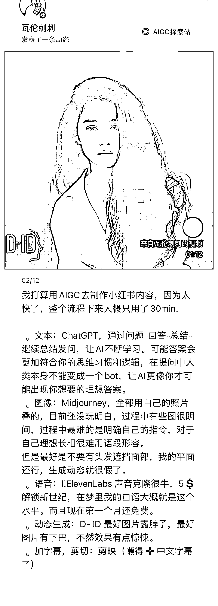

# 用 AIGC 制作小红书笔记

> 原文：[`www.yuque.com/for_lazy/xkrm14/vm5vb7scko3h3ugt`](https://www.yuque.com/for_lazy/xkrm14/vm5vb7scko3h3ugt)

作者： hedy

日期：2023-02-15

点赞数：26

正文：

仅花 30min 用 AIGC 制作小红书 文本：ChatGPT 搞定 图像：Midjourney 语音：IIElevenLabs 声音克隆 动态生成：D-ID 加字幕剪切：剪映

  <ne-p id="ub6eb8e56" data-lake-id="ub6eb8e56">评论区：

星辰 : 是不是就可以代替真人直播了

公众号懒人找资源，懒人专属群分享

</ne-p>