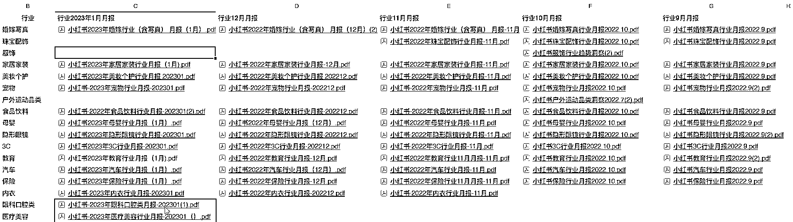

# 通过小红书行业月报，看小红书内容的商业趋势方向

> 原文：[`www.yuque.com/for_lazy/xkrm14/sf0rb0px26760wt1`](https://www.yuque.com/for_lazy/xkrm14/sf0rb0px26760wt1)

作者： 常常

日期：2023-02-17

点赞数：37

正文：

通过小红书官方渠道发布的小红书行业月报，看小红书内容的商业趋势方向 这是一个商业思路的风向标， 去年 11 月份在生财看到亦仁老大发布的小红书教育赛道行业月报，从中挖掘到机会，100 天在小红书涨粉 14 万+，证实亦仁老大说的，这里隐藏着巨大的机会； 关于小红书行业月报，做下个人思路分享： 个人博主可以从行业月报的赛道体量分析中，找到适合自己的赛道； 也可以从行业月报的变化中，看到未来一个月的内容创作趋势方向，最重要的是带货方向，这个价值在小红书完整发布一年行业月报后，会有更明显的体现。 小红书官方从 2022 年 9 月开始，在特定商家合作群每月发布上月的官方行业月报，为商家提供小红书内容赛道的趋势方向； 2022 年 10 月份，新增运动和服饰； 2022 年 11 月份，暂停运动和服饰行业月报发布，新增内衣行业月报发布； 2023 年 1 月份，新增眼科和医疗美容行业月报发布。 眼科和医疗美容赛道的球友，可以特别关注下 1 月份这个时间节点在小红书的笔记布局。 有些行业一年赚钱的机会，可能就在平台给的一个窗口。

  <ne-p id="u26eda8f5" data-lake-id="u26eda8f5">评论区：

老何为人民服务 : 想问问这些报告大佬是从哪里整理出来的，好完整啊

A 王禹灏 : 您好，报告哪里可以看到？

上川书记 : 您好，报告哪里可以看到？谢谢

公众号懒人找资源，懒人专属群分享

</ne-p>