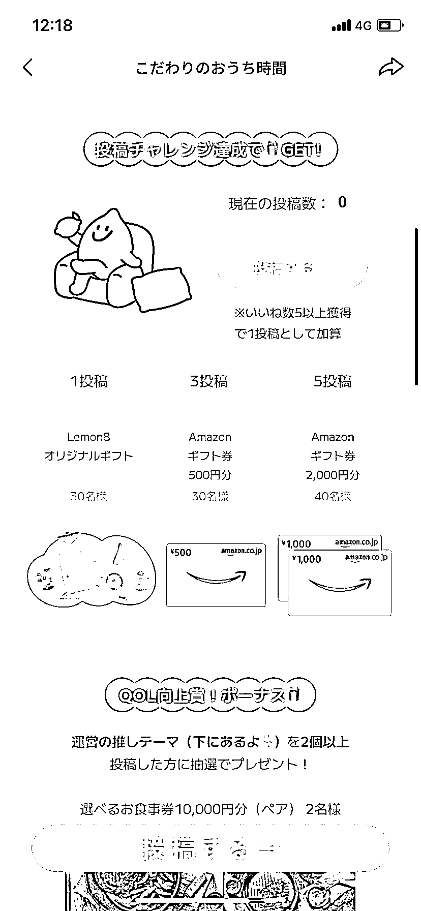

# Lemon8 这款软件在东南亚和日本有红利

> 原文：[`www.yuque.com/for_lazy/xkrm14/uwxd722nhxl4zetg`](https://www.yuque.com/for_lazy/xkrm14/uwxd722nhxl4zetg)

作者： 国强，坐标日本

日期：2023-02-16

点赞数：25

正文：

东南亚和日本正在崛起 字节旗下的，Lemon8 这款软件目前在崛起。跟小红书基本一致，可以关注一下，目前还有红利[呲牙]。小红书玩法照搬即可。 英语不好不怕，善用 chat 这类 AI 翻译软件 搞文案[吃瓜] 直接上中文也行，海外华人基数比较大[奸笑] 饿不死 图 1.平台红利政策，日本目前正在搞投稿给亚马逊购物券活动 图 2.软件内部排版，是不是跟小红书很相似。

  <ne-p id="u85333573" data-lake-id="u85333573">  <ne-p id="u873f773f" data-lake-id="u873f773f">评论区：

乐乐 : 在抖音刷到你，在生财也刷到你[强]

国强，坐标日本 : 抖音？ 咋刷到我的[呲牙]

公众号懒人找资源，懒人专属群分享

</ne-p></ne-p>