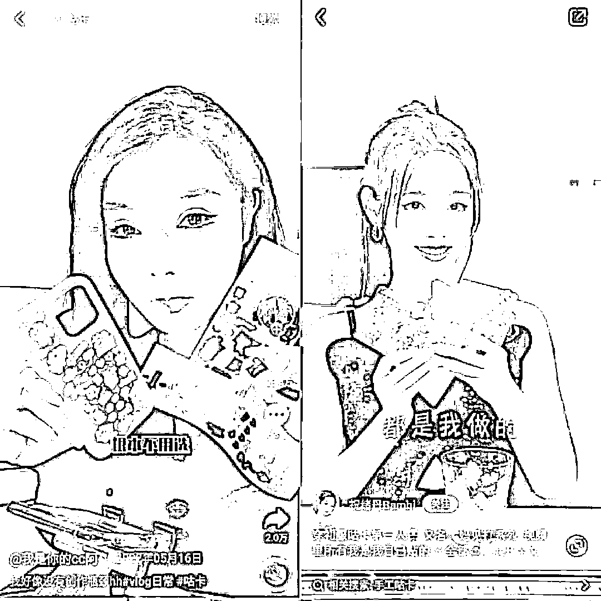
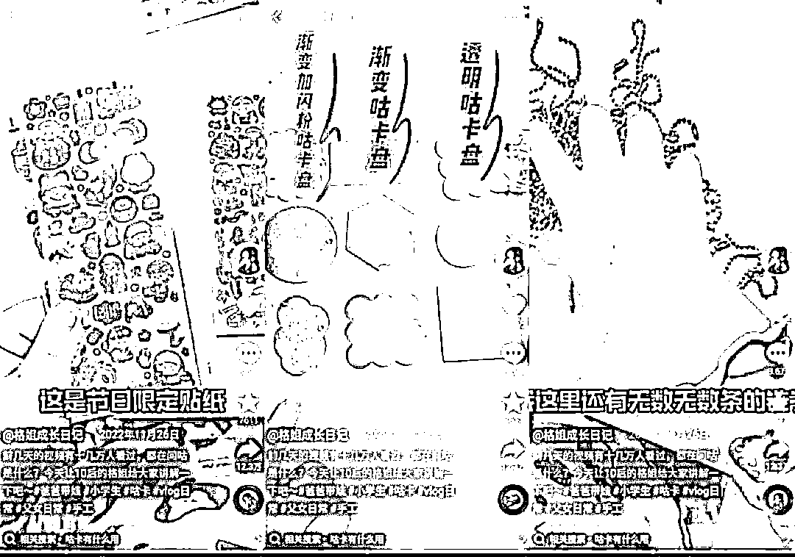
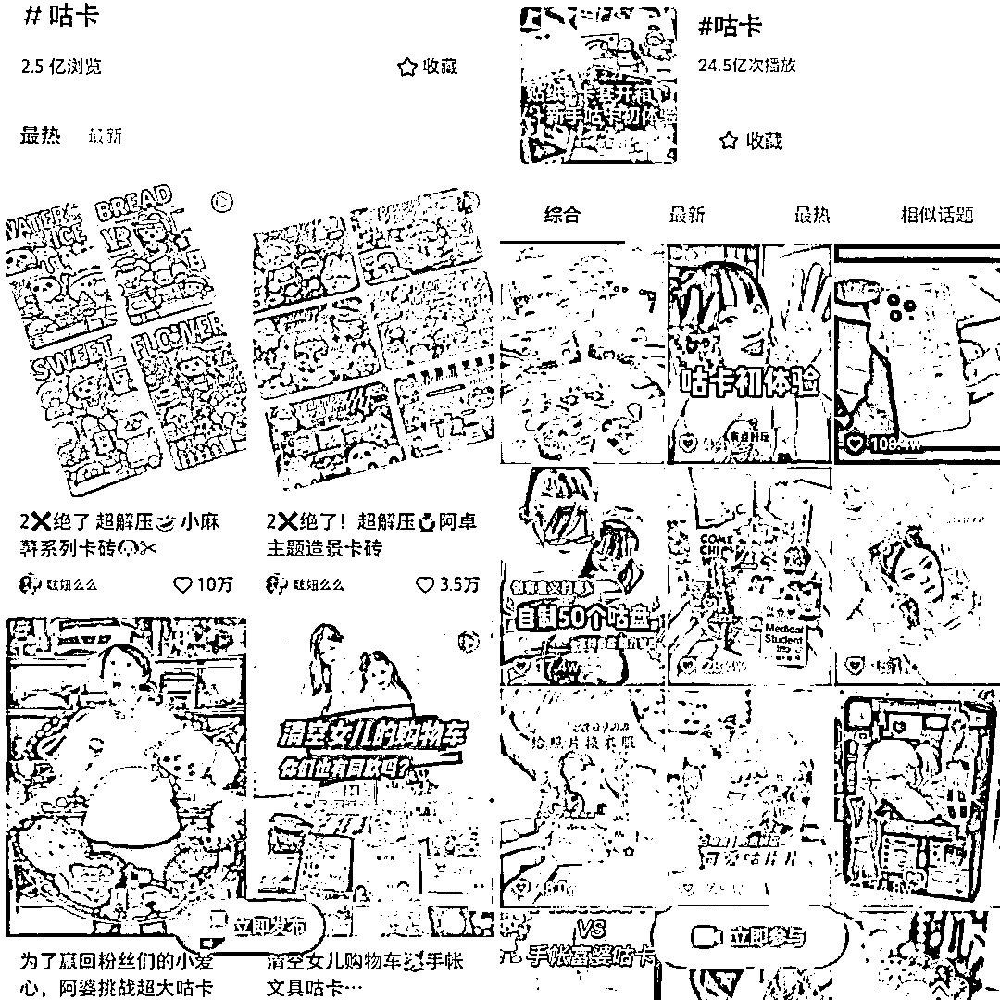
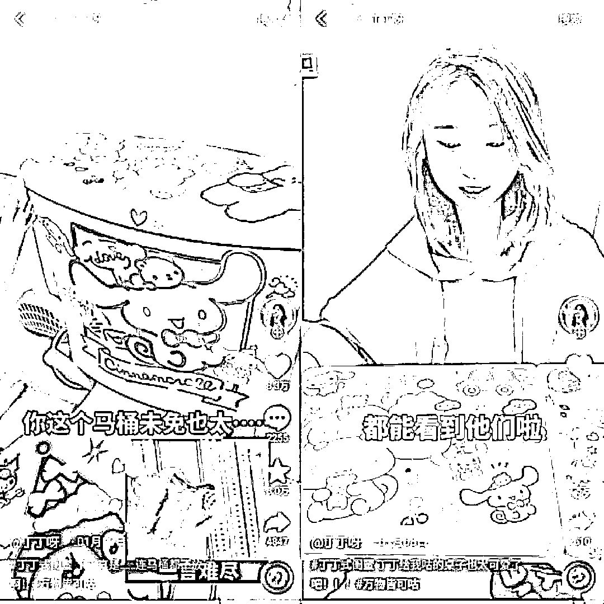

# 月售百万元的“咕卡”套装，成为 10 后社交货币

> 原文：[`www.yuque.com/for_lazy/xkrm14/xof7verm7btmt4zn`](https://www.yuque.com/for_lazy/xkrm14/xof7verm7btmt4zn)

作者： will

日期：2023-02-14

点赞数：11

正文：

万物皆可“咕”，“咕卡”已经成为了“10 后”中的社交货币！ 简单来说，“咕卡”就是用各式各样的贴纸来装饰一张卡片，和 80、90 后们在童年时代把贴纸贴在书本课桌和各种家具上的行为如出一辙。 “咕卡”起源于韩国饭圈，粉丝们常常买来偶像的贴纸精心贴在卡片上，“咕卡”一词便是韩文中“贴卡”的音译。 简单的贴纸升级成一整套精美的工具，由贴纸、咕盘、镊子和链子组成，价格也从几毛涨到几块到几十块钱不等，抖音上一款 19.9 元的咕卡卖出约 200 万销售额～ [月售百万元的“咕卡”套装，如何成为 10 后社交货币？](https://mp.weixin.qq.com/s/zXDrrEK8WYyL3iWuWQz_iA)

  

  

  

  

评论区：

暂无评论

公众号懒人找资源，懒人专属群分享

</ne-p></ne-p></ne-p></ne-p>